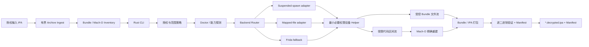

# OrchardProbe 项目蓝图（工作名）

> 面向自有或明确获授权 App 的、本地优先、可审计的 iOS 二进制导出与验证工具链。

状态：执行中的 pre-alpha 蓝图
日期：2026-07-22

当前实现快照：项目治理和安全政策、Rust Host CLI、首方 DemoLab fixture、bounded Mach-O parser、仅限库内的有界只读 IPA Archive 预检、`oprobe inspect`、capability/error/export 三类带版本的 pre-v1 JSON 契约、有界 Host/Helper 协议规范，以及 FAT/secure-open/Archive 对抗测试已落地并由必需 CI 覆盖。设备发现、真机 Helper、transport、导出后端、Archive 物化、重建、IPA 打包与 `oprobe decrypt` 仍未实现，也没有任何正式设备兼容性声明。

## 1. 核心判断

不要再做一个 `frida-ios-dump` 的翻版。旧路线的主要问题不是少几个参数，而是依赖启动或附加目标 App，容易受到 target SDK、RASP、反调试、Frida 版本和越狱环境变化影响。

项目应抢占的新位置是：

> 自动选择导出后端、USB 优先、结果逐文件验证、失败原因可诊断、输出过程可审计。

成功标准不是“偶尔能生成 IPA”，而是用户能在十分钟内知道：

- 当前设备和目标是否受支持；
- 工具选择了哪个后端；
- 主程序、Framework、dylib、Extension 分别是否完成；
- 哪个文件仍然加密或被跳过，以及原因；
- 输出的来源、哈希和签名状态。

## 2. 项目范围、合法用途与非目标

维护者只为以下场景设计、测试和提供支持：

- 开发者本人或所属团队拥有的 App；
- 获得 App 所有者或其有权代表书面授权的移动安全测试；
- 项目自建 DemoLab 和研究教学；

项目不实现或维护：

- 搜索、下载、托管或分享未经授权的第三方解密 IPA；
- Apple ID 登录、自动购买或批量抓取 App Store 内容；
- 内购、订阅、许可证、反作弊或账号限制绕过；
- 提供或执行越狱、内核漏洞利用、PAC/PPL 绕过或针对具体商业 App 的反保护绕过；
- 重签、安装、功能修改和“一键分发”；
- Keychain、Documents、Cookie、数据库等数据容器导出；
- 云端代导出服务。

真实设备操作前显示简短授权确认；CI 可显式传入 `--accept-authorized-use`。这只能提醒使用者，不能证明授权或确保某项分析在其法域合法。项目默认无遥测，不上传 IPA、日志或设备信息。

上述内容是项目范围、维护政策与安全提示，不是 Apache-2.0 的附加许可条件。拥有 App、设备或测试授权也不当然意味着可以规避任何技术措施；使用者仍须自行遵守适用法律、合同和平台条款。本文件不构成法律意见。

## 3. 竞品与机会

截至 2026-07-21：

| 项目 | 现状 | 我们应吸收/避开的点 |
|---|---|---|
| [frida-ios-dump](https://github.com/AloneMonkey/frida-ios-dump) | 历史用户多，但核心多年未更新 | 吸收一条命令的心智；避开 Python/手动 SSH/强依赖运行目标 |
| [dumpdecrypted](https://github.com/stefanesser/dumpdecrypted) | 经典内存覆盖思路，代码和平台均老 | 只研究原理；仓库未声明许可证，不复制源码 |
| [bagbak](https://github.com/ChiChou/bagbak) | UX 较好、支持多类二进制，但作者已将运行时附加路线标记为 deprecated | 吸收模式设计；Frida 只做 fallback |
| [TrollDecrypt](https://github.com/donato-fiore/TrollDecrypt) | 活跃的设备端 GUI | 证明现代设备端体验有需求；仓库未声明许可证，不复制源码 |
| [ipadecrypt](https://github.com/londek/ipadecrypt) | 当前最直接的端到端 CLI 竞品 | 必须在 USB、诊断、验证、无凭据和集成能力上明显更好 |
| [flexdecrypt](https://github.com/JohnCoates/flexdecrypt) | 奠定不完整运行目标 App 的方向，但实现面向旧环境 | 以能力探测封装相关路径，不承诺所有系统版本 |

待验证的项目假设是：历史高关注项目普遍老化，而现代活跃项目仍未形成兼容矩阵清晰、工程质量稳定的事实标准。公开 beta 前通过用户访谈、Issue 和可复现兼容报告验证该假设。

## 4. 产品形态

工作名：`OrchardProbe`
CLI：`oprobe`

一句话英文定位：

> Local-first, auditable Mach-O decryption and app export from explicitly supported jailbroken iOS devices, for binaries you are legally authorized to analyze.

首版命令面：

```text
oprobe decrypt <input.ipa> [--output <output.ipa>] [--json]
oprobe doctor [--json]
oprobe inspect <macho> [--json]
oprobe devices [--json]
oprobe apps [--json]
oprobe verify <ipa-or-app> [--json]
oprobe demo
```

其中 `verify <ipa-or-app>` 是未来产物验证接口；当前 pre-alpha 只实现
`verify <manifest.json>`，两者不能混为已经可用的同一命令。

关键体验：

1. 正常用户只运行 `oprobe decrypt MyApp.ipa`，默认得到 `MyApp.decrypted.ipa` 和 `MyApp.decrypted.manifest.json`。
2. 输入 IPA 作为不可变本地重建模板；工具自动匹配受支持设备上已经安装的同一构建。输入文件本身不能替代授权设备端代码证据。
3. `decrypt` 自动执行 Doctor、设备/构建匹配、后端选择、逐 Mach-O 重建、验证和原子打包；`devices/apps` 只用于诊断。
4. 输出为未重签、仅供分析的 IPA/Bundle 与独立 `manifest.json`；嵌入签名可能仍存在但已经失效。
5. `oprobe verify` 逐个 Mach-O 报告证据等级，不用 `cryptid == 0` 或“生成 ZIP 成功”冒充明文字节已验证。
6. `oprobe demo` 无需设备，使用项目自建 fixture 展示解析、重建和验证流程。

## 5. 技术路线

### 5.1 后端选择

采用可插拔后端。Sprint 0 先对两个候选做 go/no-go 验证，再决定 MVP 默认项：

1. 候选 A `suspended-spawn`：只让系统完成必要的早期映射，不要求 App 完整运行。
2. 候选 B `mapped-file`：在确认系统、权限和目标格式受支持时使用映射解密路径。
3. 后续候选 `frida-runtime`：仅作为兼容回退，在其他后端不可用且目标能够安全启动时评估。

可行性和优先级不能仅由 iOS 版本硬编码，应由 helper 返回的 capability handshake、SoC、页大小、entitlements、rootless/rootful 状态和目标格式共同决定。Sprint 0 必须验证：在不修改、重签或重装目标 App 的前提下，是否能取得所需能力并只读取精确的目标代码区间；若不能，缩减或调整 MVP，而不是维持未经证明的承诺。

首版不实现多个后端。MVP 只打通一个经过实机验证的现代后端，但协议从第一天允许增加 adapter。

### 5.2 技术栈

- Host CLI：Rust，先支持 Apple Silicon macOS；后续评估 Intel macOS、Linux 和 Windows。
- Device helper：Objective-C/C，仅申请经 spike 证明的最小必要权限与 entitlements，并保持短生命周期。
- Frida adapter：TypeScript，仅作可选依赖。
- Host/device 协议：版本化、长度前缀消息；只开放目标枚举、受限代码区间读取，以及所选 bundle 根目录内经过 canonical path、symlink、文件数量与总大小限制的文件流，不开放任意 shell、任意路径、任意 PID 或任意内存 RPC。
- 连接：MVP 采用 usbmuxd 转发的 USB tunnel 和受限自定义协议；SSH 仅作开发期后备，helper 不监听局域网公网地址。helper 的安装和启动方式由 Sprint 0 根据首个实测环境写入兼容文档。

### 5.3 模块



核心模块：

- `ingest`：把 IPA 当作不可信 Archive，在物化前执行 Entry、路径、链接、压缩比、文件数量和总大小限制；源 IPA 永远不原地修改。
- `doctor`：设备、iOS、SoC、页大小、rootless/rootful、可用权限、依赖和磁盘空间。
- `transport`：USB tunnel、开发期 SSH fallback、断线重连、chunked streaming。
- `catalog`：从输入 IPA 建立主程序、Framework、dylib、Extension 清单，并将其唯一匹配到设备上的同一已安装构建。
- `macho`：安全解析 load commands，只替换明确标记的代码区间，不覆盖已发生 relocation/PAC fixup 的其他内存页。
- `collector`：只复制 `.app` bundle，阻止路径穿越和 symlink escape，默认剔除 receipt、`SC_Info` 和数据容器。
- `packager`：确定性 ZIP、保持相对路径和权限，不重签、不安装。
- `verifier`：逐 slice/二进制报告四级证据：metadata 状态、结构完整性、后端读写区间哈希一致性，以及仅对自有 fixture 可用的已知明文预期。没有明文 oracle 时必须输出 `inconclusive`，不能把 `cryptid == 0` 当作完整证明。
- `report`：v1 前使用显式版本号且允许演进的 JSON schema；后续支持 SARIF/HTML 和企业流水线。签名信息拆成互不混淆的字段：`presence`（`absent/present/unknown`）、`kind`（如 `cms/ad_hoc/unknown/not_applicable`）和 `validation`（`valid/invalid/not_checked/not_applicable`）。

### 5.4 建议仓库结构

```text
orchardprobe/
├── crates/
│   ├── cli/
│   ├── core/
│   ├── macho/
│   ├── archive/
│   ├── protocol/
│   └── report/
├── device/
│   ├── helper/
│   └── adapters/
├── fixtures/
│   └── DemoLab/
├── docs/
│   ├── architecture/
│   ├── compatibility/
│   ├── security/
│   └── troubleshooting/
├── schemas/
└── .github/
```

## 6. MVP 边界

MVP 只承诺：

- Apple Silicon macOS host；
- 一种明确记录的越狱/设备组合；
- `oprobe decrypt <input.ipa>` 一条命令的成功路径；输入 IPA 与设备上已经安装的同一构建必须唯一匹配；
- 首个实测设备的 native slice；arm64e/A12+ 只有通过独立实机验证后才加入支持矩阵；
- 主可执行文件；如果 Framework/Extension 未完成，manifest 必须明确标记；
- USB 连接、结构化日志、输出哈希、验证报告；
- 未重签、仅供静态分析的 IPA/Bundle；原签名可能存在但失效。

MVP 不承诺：

- “支持所有 iOS 版本/所有越狱”；
- Stock iPhone 上处理生产签名的普通 App Store App；
- Universal IPA、ODR、Watch App、App Clip；
- 自动下载、重签、安装或绕过应用自带保护；
- 远程服务和 GUI。

## 7. 实施计划

### Sprint 0：1 周，先证明方向

- [x] 固化 `RFC-0001 Scope and Threat Model`。
- [x] 建立 Apache-2.0、`LEGAL.md`、`ACCEPTABLE_USE.md`、`SECURITY.md`。
- [x] 创建 DemoLab：Swift 主程序 + Objective-C 动态 Framework + Extension。
- [x] 定义 capability、export manifest、error code 三个带版本、边界明确且由 Rust/CI 验证的 JSON schema。
- [x] 固化 `RFC-0002` 有界 Host/Helper 协议、状态机、资源上限与 No-Go 条件；该 RFC 不实现 transport、Helper 或设备后端。
- [ ] 用一台目标设备分别验证候选后端，在不修改或重装目标 App 的前提下能否取得所需能力并读出精确代码区间。
- [ ] 退出条件：能对自有 fixture 生成可重复的字节级真机验证结果；若声称受保护到明文的能力，fixture 必须确实处于有独立证据的相应初始保护状态，普通未加密开发构建不能满足该声明。

### v0.1：第 2–4 周

- 一条命令的 `oprobe decrypt <input.ipa>` 用户流程，以及用于排错的 `doctor/devices/apps`。
- USB transport 与最小 helper。
- 单一后端处理主程序。
- Host 端 Mach-O 重建、打包和 `verify`。
- 原子输出、断线处理、JSON 日志、隐私脱敏。
- 发布 `v0.1.0-alpha`，只邀请 10–20 名授权测试者。

### v0.3：第 5–7 周

- Framework/dylib 递归识别与逐文件状态。
- Extension 按独立进程处理；不能启动时明确 skipped。
- 第二后端或 Frida fallback。
- Homebrew tap、shell completion、签名制品、SHA-256、SBOM。
- 公开兼容矩阵和双语文档。

### v0.6：第 8–10 周

- 断点恢复、批处理、带 schema 版本且仍可演进的 JSON API。
- library/JSON-RPC 集成接口。
- Mach-O、plist、ZIP、RPC fuzzing。
- 自托管真机矩阵；fork PR 永不接触设备凭据或高权限 runner。

### v0.9 / v1.0：目标第 11–13 周，Sprint 0 后重估

- 协议和 manifest schema 稳定。
- 安全审查、兼容性报告、迁移说明和维护者流程。
- 至少两名能评审 Release 的维护者。
- 只有 Quick Start 中位时间不超过 10 分钟、支持矩阵通过率不低于 90% 时才发布 v1.0。

## 8. 测试护城河

- 单元测试：Mach-O 边界、异常 load command、整数溢出、不同页大小、FAT/thin、UTF-8 路径。
- 合成 fixture：仓库只提交自行生成的“磁盘区间 + 预期区间”样本，不提交第三方二进制。
- Fuzz：Mach-O、plist、ZIP 和 RPC；重点覆盖 Zip Slip、symlink escape、解压炸弹、长度欺骗。
- 故障注入：拔线、进程提前退出、短读、低磁盘、helper 重启、Extension 无法启动。
- 实机矩阵：每个 Release 发布具体设备/iOS/SoC/环境/commit 的验证记录，不使用“理论支持”冒充“实测支持”。
- 真机 CI：专用设备和账号；不得上传 IPA、receipt、原始 UDID 或未脱敏日志。

## 9. GitHub 冷启动

README 默认英文，完整提供 `README.zh-CN.md`。首屏依次展示：

1. 一句话定位与 Authorized use only；
2. 安装命令与 `oprobe decrypt DemoLab.ipa` 的一条命令 Quick Start；
3. `oprobe demo`；
4. 30–45 秒终端 GIF；
5. 真实支持矩阵；
6. 输出 manifest 示例；
7. 架构、隐私、威胁模型和非目标。

仓库首发即具备：

- README、Apache-2.0、Contributing、Code of Conduct、Security Policy；
- Issue Forms、PR 模板、Discussions、Private Vulnerability Reporting；
- 10–15 个已拆小的 `good first issue`；
- 分支保护、最小 Actions 权限、依赖锁定、CodeQL/静态分析；
- 签名 tag、checksums、SBOM 和 artifact attestation；
- `CITATION.cff`、架构 ADR、带版本的错误码和 troubleshooting 文档。

公开发布前先完成闭门 alpha，不宣传空仓库。公开 beta 所需素材：

- 30–45 秒终端 GIF；
- 3 分钟从 DemoLab 到验证报告的视频；
- 一篇技术文章：为何 iOS 授权二进制导出需要可审计、可复现；
- 一篇架构与威胁模型文章；
- 真实兼容矩阵和失败案例。

Star 不是北极星指标。以下是 90 天目标，不是对外承诺；首次成功率只统计支持矩阵内、版本有效且授权明确的测试：

- 首次成功率至少 90%；
- 首次成功中位时间不超过 10 分钟；
- 15 个以上真实验证组合；
- 15 名以上外部贡献者、5 名以上重复贡献者；
- 30 个以上外部合并 PR；
- 90% 的 Issue 在 48 小时内得到首次响应；
- Release asset 下载量达到 1,500。

Release 下载量包含机器人和重复下载，只作趋势信号。Stars 可设 1,000 为 target、3,000 为 stretch，但不买星、不互刷、不以 Star 换福利。

## 10. 发布门槛和主要风险

主要风险：

- iOS、Frida 和越狱环境快速漂移；用能力探测、后端隔离和机器可读兼容矩阵控制。
- arm64e/PPL 和目标格式变化导致部分组合不可行；必须诚实失败，不承诺“全版本”。
- 输出被误认为可直接安装；每次输出都标记签名状态，项目不提供 signer/installer。
- 具备特殊 entitlements 或高权限的 helper 变成攻击面；禁止 shell、任意路径/PID/内存接口，发布版默认只经 USB tunnel 且保持短生命周期；开发期 SSH fallback 必须显式启用并与发布配置隔离。Spike 后公开准确的 entitlement 与威胁模型。
- 恶意 IPA 攻击 Host；复杂解析放在内存安全语言中并持续 fuzz。
- 许可证污染；未明确许可的旧项目只做行为研究，禁止复制其代码，采用独立实现并在 ADR 中记录来源和贡献者声明；除非建立了真正隔离的流程，否则不宣称 clean-room。
- 法律与声誉；只用 DemoLab 展示，不出现商业 App 名称、图标、IPA 或商店截图。

## 11. 下一步

公开仓库当前处于 foundation/pre-alpha 阶段。接下来依次完成：

1. 确认工作名和品牌检查；
2. 确认首台测试设备的型号、SoC、iOS 版本、越狱方案及 rootless/rootful；
3. 先完成 Sprint 0 技术 spike；
4. 完善 monorepo、CI 和社区健康文件；
5. v0.1 alpha 可复现后再推广项目并发布可执行制品。

`OrchardProbe` 目前仅是工作名。除本仓库外，GitHub 仓库搜索未发现明显同名项目，但这不等于商标许可；仍需检查 organization、crates.io、Homebrew、npm/PyPI、域名和相关商标。当前公开仓库为 `jacklv-coder/OrchardProbe`，本地已初始化 Git 并连接 `origin/main`。
