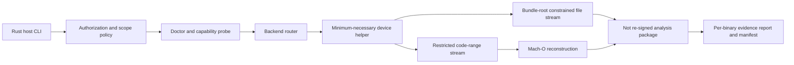

# OrchardProbe

> Local-first, auditable Mach-O decryption and app export from explicitly supported jailbroken iOS devices, for binaries you are legally authorized to analyze.

[简体中文](README.zh-CN.md)

> [!IMPORTANT]
> **Pre-alpha:** OrchardProbe is a working name. The repository now contains device-free Rust host tools, a first-party simulator fixture, the project plan, and foundational policies—but no device backend, working exporter, supported-device matrix, release, or installation instructions.

OrchardProbe is intended to make authorized iOS binary research more transparent and reproducible. The planned workflow will detect device capabilities, select a narrowly scoped export backend, verify every relevant Mach-O independently, and record what succeeded, failed, or was skipped in a machine-readable manifest.

It is not intended to promise support for every iOS version, device, jailbreak, or app. The first usable milestone will deliberately target Apple Silicon macOS and one explicitly documented, physically tested device environment before compatibility expands.

## Development snapshot

The current code is intentionally host-only. It can report local pre-alpha status, inspect bounded header metadata from one local Mach-O file, emit a deterministic synthetic manifest, and validate that manifest's schema and path-safety invariants:

```sh
cargo run --locked -p orchardprobe-cli -- doctor --json
cargo run --locked -p orchardprobe-cli -- inspect path/to/Mach-O --json
cargo run --locked -p orchardprobe-cli -- demo --json
cargo run --locked -p orchardprobe-cli -- verify path/to/manifest.json --json
```

These commands do not connect to a device, decrypt a binary, process an IPA, or prove plaintext. `inspect` accepts one regular Mach-O file and reads only bounded container, slice, and load-command metadata; see [its exact contract](docs/development/macho-inspect.md). Capability, structured-error, and export-manifest values now have [versioned, bounded pre-v1 contracts](docs/development/schemas.md), but no device backend implements them yet. The repository-owned [DemoLab fixture](fixtures/DemoLab/README.md) provides a Swift app, an Objective-C dynamic framework, and a share extension for safe, repeatable simulator builds. See [the Rust development guide](docs/development/getting-started.md) for the pinned toolchain and validation commands.

## Authorized use only

Use OrchardProbe only with apps that you or your organization own, or where the owner has given you explicit authorization to perform the proposed testing. You are responsible for complying with applicable law, platform terms, contracts, and the limits of that authorization.

Before participating, read:

- [Legal and authorization notice](LEGAL.md)
- [Acceptable Use Policy](ACCEPTABLE_USE.md)
- [Security Policy](SECURITY.md)
- [Scope and threat model](docs/architecture/RFC-0001-scope-and-threat-model.md)
- [Compatibility evidence policy](docs/compatibility/README.md)

## Project vision

The goal is not merely to produce an archive. A successful export should be explainable and independently verifiable:

- `doctor` reports whether the host, device, permissions, and dependencies are suitable.
- Backend selection is capability-driven and recorded instead of inferred from an iOS version alone.
- The main executable, frameworks, dynamic libraries, and extensions receive separate results.
- Input and output hashes, Mach-O metadata, signature state, evidence level, and failure reasons appear in a versioned manifest.
- Unsupported combinations fail clearly; packaging a ZIP is never presented as proof that every binary was processed correctly.

## Planned scope

The planned toolchain will:

- discover explicitly connected devices and enumerate in-scope user apps;
- prefer USB transport, with a constrained SSH path considered only as a fallback;
- use a short-lived device helper with only the minimum necessary privileges and entitlements proven by the technical spike;
- stream only required code ranges and files beneath the selected bundle root, with strict path and size limits and without exposing arbitrary shell, path, PID, or memory access;
- safely reconstruct and validate Mach-O binaries on the host;
- create a **not re-signed, analysis-only** app bundle or IPA plus a separate `manifest.json`; an embedded signature may remain present but invalid;
- provide a device-free demo based solely on first-party, generated fixtures.

Initial compatibility will be intentionally narrow and backed by concrete test records. See [PROJECT_PLAN.md](PROJECT_PLAN.md) for the current MVP boundary.

## Non-goals

OrchardProbe will not provide or facilitate:

- searching for, downloading, hosting, or sharing unauthorized third-party decrypted IPAs;
- Apple ID sign-in, automated purchasing, or bulk App Store acquisition;
- bypassing purchases, subscriptions, licenses, anti-cheat systems, account restrictions, or app-specific protections;
- providing or executing jailbreaks, kernel exploits, PAC/PPL bypasses, or targeted bypasses for commercial apps;
- re-signing, installation, feature modification, or one-click redistribution;
- extraction of Keychain items or app data containers such as Documents, cookies, or databases;
- a cloud-based export service.

Requests or contributions that add these capabilities are outside the project scope.

## Current and planned CLI

The host-only commands available from source today are:

```text
oprobe doctor [--json]
oprobe inspect <MACH-O> [--json]
oprobe demo [--json]
oprobe verify <manifest.json> [--json]
```

The device and artifact commands below are future design placeholders and are not implemented:

```text
oprobe devices
oprobe apps
oprobe export <bundle-id> --output <path>
oprobe verify <ipa-or-app> [--json]
```

There are intentionally no release installation commands yet. The Cargo commands above are for contributors and will be replaced with installation documentation only after a reproducible alpha release exists.

## Architecture overview



The host is planned as a Rust workspace. A small Objective-C/C helper will perform only the required device-side operation. Sprint 0 will compare suspended-spawn and mapped-file candidates before choosing an MVP backend; neither is currently claimed to work. Backend adapters will remain isolated behind a versioned capability handshake, allowing the project to add a second implementation without widening the helper into a general-purpose remote access service.

## Privacy and safety principles

- Local-first operation: app bundles, generated reports, logs, and raw device details stay on the user's machines. A user may separately choose to submit only the sanitized environment metadata requested by the public compatibility form, without stable device identifiers.
- No automatic telemetry: official software does not automatically collect or transmit usage, IPA, log, or device data. GitHub issues are manual, opt-in submissions governed by the [compatibility evidence policy](docs/compatibility/README.md).
- Minimal collection: only the `.app` bundle is in scope; receipts, `SC_Info`, and data containers are excluded by design.
- Auditable output: structured reports explain backend choice, per-file status, hashes, signing state, and evidence level. Metadata such as `cryptid == 0` alone is never treated as proof of correct plaintext; results without a plaintext oracle are marked inconclusive.
- Honest compatibility: public support claims require maintainer reproduction and a sanitized real-device record under the [compatibility evidence policy](docs/compatibility/README.md).
- Safe fixtures: repository tests use project-generated DemoLab artifacts, never proprietary third-party binaries.

## Roadmap

OrchardProbe is currently in **Sprint 0 / project foundation**.

1. **Sprint 0:** freeze the scope and threat model, define schemas, build DemoLab fixtures, and validate one narrow technical spike on an owned test app.
2. **v0.1 alpha:** add the Rust CLI skeleton, capability diagnostics, USB transport, one tested backend, reconstruction, packaging, and verification.
3. **v0.3:** expand per-binary coverage, add another backend or fallback, and publish a real compatibility matrix.
4. **v0.6:** harden resumability, structured integration, fuzzing, and self-hosted device testing.
5. **v1.0:** stabilize the protocol and manifest only after an independent security review and measurable reliability targets are met.

This roadmap describes direction, not guaranteed dates or compatibility. The detailed plan and release gates live in [PROJECT_PLAN.md](PROJECT_PLAN.md).

## Contributing

Contributions are welcome while the project is taking shape, especially around threat modeling, schema design, safe parsers, generated fixtures, diagnostics, documentation, and reproducible compatibility reporting. Please read [CONTRIBUTING.md](CONTRIBUTING.md) before opening an issue or pull request.

Do not attach proprietary IPAs, decrypted commercial binaries, receipts, credentials, raw device identifiers, or confidential client material to an issue or pull request.

Security-sensitive findings should follow [SECURITY.md](SECURITY.md), not a public issue.

## License and independence

Repository source is available under the [Apache License 2.0](LICENSE). That license does not grant rights to any app, device, platform, or content analyzed with OrchardProbe. OrchardProbe is an independent project and is not affiliated with or endorsed by Apple Inc.
