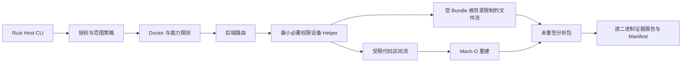

# OrchardProbe

> 从明确支持的越狱 iOS 设备本地导出 App，并对有权分析的二进制执行可审计 Mach-O 解密与证据报告。

[English](README.md)

> [!IMPORTANT]
> **Pre-alpha：** OrchardProbe 目前只是工作名。仓库现已包含无需设备的 Rust Host 工具、首方模拟器 fixture、项目规划和基础治理政策，但仍没有设备后端、可用的导出工具、已验证的设备支持矩阵、正式版本或安装说明。

OrchardProbe 希望让经过授权的 iOS 二进制研究更透明、更可复现。计划中的工作流会探测设备能力、选择边界明确的导出后端、分别验证每个相关 Mach-O，并在机器可读的 manifest 中记录成功、失败和跳过的项目。

项目不会承诺支持所有 iOS 版本、设备、越狱环境或 App。首个可用里程碑会刻意收窄范围：先支持 Apple Silicon macOS，并只支持一种经过明确记录和真机验证的设备环境，再逐步扩展兼容性。

## 当前开发快照

当前代码刻意只实现 Host 端基础能力：报告本机 pre-alpha 状态、读取单个本地 Mach-O 的有界 Header 元数据、输出确定性的合成 manifest，以及检查 manifest 的 Schema 与路径安全约束。

```sh
cargo run --locked -p orchardprobe-cli -- doctor --json
cargo run --locked -p orchardprobe-cli -- inspect path/to/Mach-O --json
cargo run --locked -p orchardprobe-cli -- demo --json
cargo run --locked -p orchardprobe-cli -- verify path/to/manifest.json --json
```

这些命令不会连接设备、解密二进制、处理 IPA，也不能证明明文字节正确。`inspect` 只接受一个普通 Mach-O 文件，并仅读取有界的容器、Slice 与 Load Command 元数据；精确契约见 [Mach-O inspect 开发文档](docs/development/macho-inspect.md)。仓库自有的 [DemoLab fixture](fixtures/DemoLab/README.md) 提供 Swift 主 App、Objective-C 动态 Framework 和 Share Extension，用于安全且可复现的模拟器构建。固定工具链和验证命令见 [Rust 开发指南](docs/development/getting-started.md)。

## 仅限授权用途

只能将 OrchardProbe 用于你本人或所在组织拥有的 App，或 App 所有者已经明确授权你开展相应测试的场景。你有责任遵守适用法律、平台条款、合同以及授权范围。

参与项目前请阅读：

- [法律与授权说明](LEGAL.md)
- [可接受使用政策](ACCEPTABLE_USE.md)
- [安全政策](SECURITY.md)
- [范围与威胁模型](docs/architecture/RFC-0001-scope-and-threat-model.md)
- [兼容性证据政策](docs/compatibility/README.md)

## 项目愿景

目标不只是生成一个压缩包。一次成功的导出应当可解释、可独立验证：

- `doctor` 会说明 Host、设备、权限和依赖是否满足要求。
- 后端选择基于能力探测并被记录，而不是只根据 iOS 版本猜测。
- 主程序、Framework、动态库和 Extension 分别产生结果。
- 输入/输出哈希、Mach-O 元数据、签名状态、证据等级和失败原因写入带版本的 manifest。
- 不支持的组合应明确失败；ZIP 打包成功不会被当作所有二进制均已正确处理的证明。

## 计划范围

计划中的工具链将会：

- 发现明确连接的设备，并只枚举政策范围内的用户 App；
- 优先使用 USB，仅将受约束的 SSH 通道作为备选方案；
- 使用短生命周期的设备 Helper，并只申请技术 Spike 证明必需的最小权限和 entitlements；
- 只传输重建所需的代码区间，以及所选 Bundle 根目录下经过路径和大小限制的文件，不提供任意 Shell、任意路径、任意 PID 或任意内存访问；
- 在 Host 端安全地重建和验证 Mach-O 二进制；
- 生成**未重签、仅供分析**的 App Bundle 或 IPA，并附带独立的 `manifest.json`；嵌入签名可能仍然存在但已经失效；
- 基于项目自行生成的 fixture 提供无需设备的 Demo。

初始兼容范围会刻意保持狭窄，且每项支持声明都必须有具体实测记录。当前 MVP 边界详见 [PROJECT_PLAN.md](PROJECT_PLAN.md)。

## 明确不做

OrchardProbe 不会提供或帮助实现：

- 搜索、下载、托管或分享未经授权的第三方解密 IPA；
- Apple ID 登录、自动购买或批量获取 App Store 内容；
- 绕过购买、订阅、许可证、反作弊、账号限制或 App 专用保护；
- 提供或执行越狱、内核漏洞利用、PAC/PPL 绕过或针对商业 App 的定向绕过；
- 重签、安装、功能修改或一键再分发；
- 导出 Keychain 项目，或 Documents、Cookie、数据库等 App 数据容器；
- 云端代导出服务。

增加上述能力的请求或贡献均不在项目范围内。

## 当前与计划中的 CLI

当前可以从源码运行的 Host-only 命令是：

```text
oprobe doctor [--json]
oprobe inspect <MACH-O> [--json]
oprobe demo [--json]
oprobe verify <manifest.json> [--json]
```

以下设备与产物命令仍只是未来设计占位，目前尚未实现：

```text
oprobe devices
oprobe apps
oprobe export <bundle-id> --output <path>
oprobe verify <ipa-or-app> [--json]
```

目前有意不提供 Release 安装命令。上面的 Cargo 命令只面向贡献者；只有在可复现的 alpha 版本发布后，项目才会添加正式安装文档。

## 架构概览



Host 端计划采用 Rust workspace。小型 Objective-C/C Helper 只执行必要的设备端操作。Sprint 0 会先比较 suspended-spawn 和 mapped-file 两个候选，再决定 MVP 后端；当前尚不宣称其中任何一个可用。各后端 Adapter 会隔离在版本化 capability handshake 之后，使项目可以增加第二种实现，同时避免把 Helper 扩展为通用远程访问服务。

## 隐私与安全原则

- 本地优先：App Bundle、报告、日志和设备详情留在用户自己的机器上。
- 无遥测：项目不收集使用信息、IPA、日志或设备数据。
- 最小采集：只有 `.app` Bundle 在范围内；receipt、`SC_Info` 和数据容器按设计排除。
- 输出可审计：结构化报告说明后端选择、逐文件状态、哈希、签名状态和证据等级。`cryptid == 0` 等元数据本身不能证明明文字节正确；没有明文 oracle 时必须标记为 `inconclusive`。
- 兼容性诚实：公开宣称支持前必须由维护者复现，并按[兼容性证据政策](docs/compatibility/README.md)保存经过脱敏的真机记录。
- 安全 fixture：仓库测试只使用项目生成的 DemoLab 产物，不使用第三方专有二进制。

## 路线图

OrchardProbe 当前处于 **Sprint 0 / 项目基础建设**阶段。

1. **Sprint 0：** 固化范围与威胁模型，定义 Schema，构建 DemoLab fixture，并用自有测试 App 验证一个边界明确的技术 Spike。
2. **v0.1 alpha：** 加入 Rust CLI 骨架、能力诊断、USB 传输、一个实测后端、重建、打包和验证。
3. **v0.3：** 扩展逐二进制覆盖，加入第二后端或回退方案，并发布真实兼容矩阵。
4. **v0.6：** 加固断点恢复、结构化集成、Fuzz 和自托管真机测试。
5. **v1.0：** 只有在独立安全审查完成且可靠性指标达标后，才稳定协议与 manifest。

路线图表达方向，不代表日期或兼容性承诺。详细计划和发布门槛见 [PROJECT_PLAN.md](PROJECT_PLAN.md)。

## 参与贡献

项目仍在成形阶段，欢迎对威胁建模、Schema 设计、安全解析器、自生成 fixture、诊断、文档和可复现兼容性报告做出贡献。提交 Issue 或 Pull Request 前请阅读 [CONTRIBUTING.md](CONTRIBUTING.md)。

请勿在 Issue 或 Pull Request 中附加专有 IPA、商业 App 的解密二进制、receipt、凭据、原始设备标识符或客户机密材料。

安全敏感问题请按 [SECURITY.md](SECURITY.md) 私下报告，不要创建公开 Issue。

## 许可证与独立性

仓库源码采用 [Apache License 2.0](LICENSE)。该许可证不会授予对 OrchardProbe 所分析的任何 App、设备、平台或内容的权利。OrchardProbe 是独立项目，与 Apple Inc. 无关联，也未获其认可或背书。
