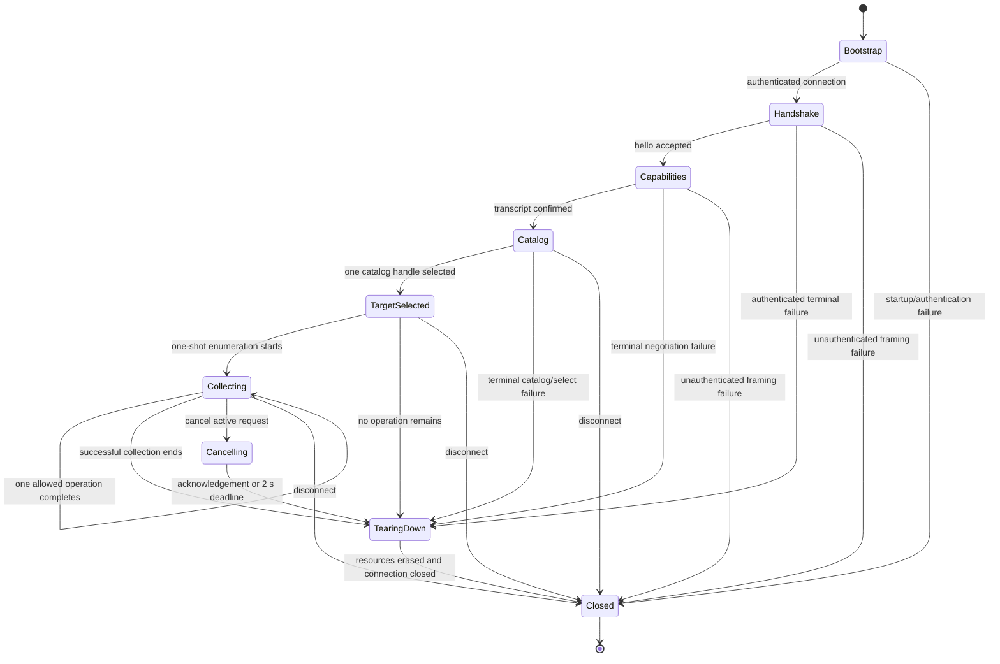
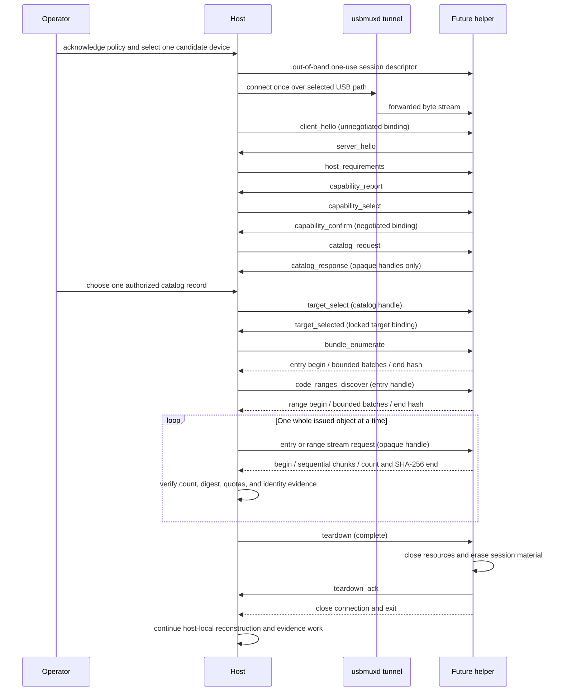
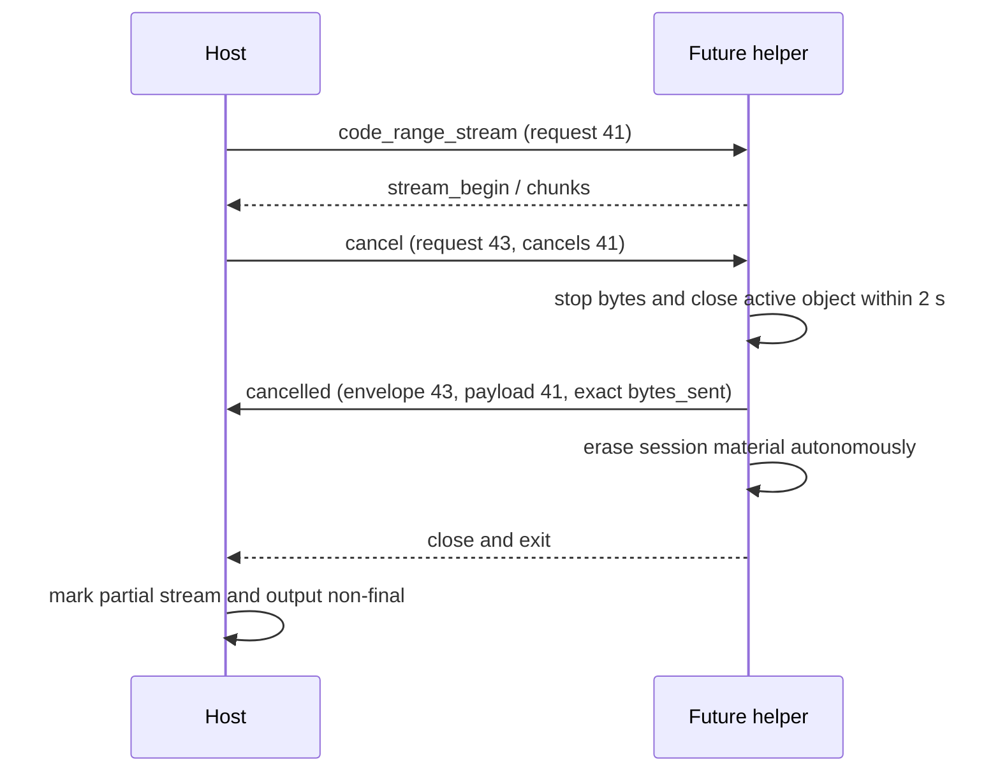
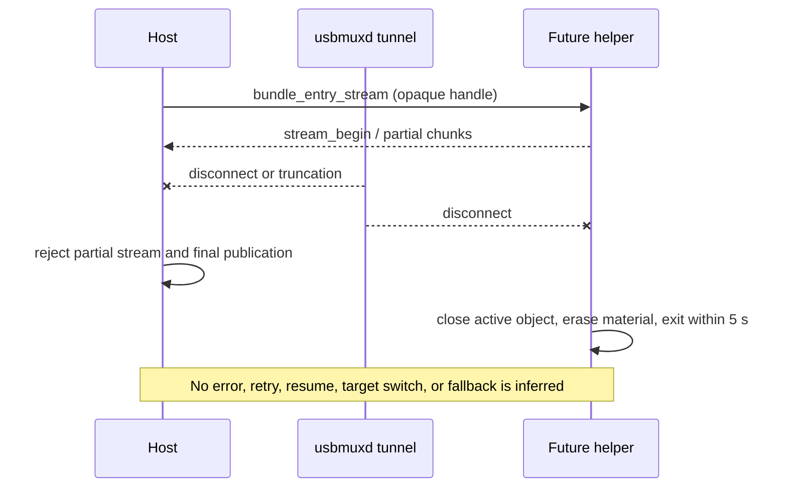
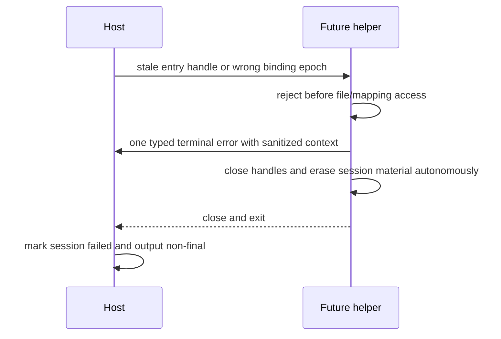

# RFC-0002: Bounded host/helper protocol

- Status: Accepted as a device-free design gate; implementation blocked
- Date: 2026-07-21
- Tracking issue: [#8](https://github.com/jacklv-coder/OrchardProbe/issues/8)

## Summary

This RFC specifies a smallest-useful, authenticated, bounded protocol between
the future OrchardProbe macOS host and a future short-lived iOS helper. The
protocol is limited to one explicitly selected candidate device, one fresh
session, one server-resolved target, contained app-bundle enumeration, and
whole-object streams addressed only by opaque helper-issued handles.

This is a specification, not a backend. No helper, device transport, protocol
parser, target resolver, bundle collector, or code-range producer is
implemented by this RFC. It does not establish compatibility with any device,
iOS version, jailbreak, app, binary format, or protected-input state. Running
anything on a real device remains blocked by the Go/No-Go checklist in
[RFC-0001](RFC-0001-scope-and-threat-model.md) and a backend-specific ADR.

The v0.1 profile deliberately has one foreground request at a time, one stream
at a time, no automatic retry, no transport fallback, and no target switch. It
has no operation for shell text, executable upload, arbitrary paths, PIDs,
task ports, raw addresses, caller-selected offsets or lengths, generic reads
or writes, process launch, process control, or app-data access.

## Normative language

The terms **MUST**, **MUST NOT**, **SHOULD**, and **MAY** describe requirements
for a future implementation. They do not claim that an implementation exists.
An exception to a MUST or MUST NOT requires a new reviewed RFC or ADR.

All numeric limits in this document are hard ceilings for protocol v0.1. A
negotiated value is the minimum of the two peers' local ceilings and the
corresponding v0.1 ceiling. A peer cannot raise a ceiling. Any operation, field,
resource, deadline, collection, or platform behavior without an explicit limit
in this RFC is **not authorized for implementation** until a reviewed revision
adds one.

## Relationship to existing contracts

This RFC refines, but does not weaken, RFC-0001. The checked-in pre-v1
contracts remain the source of truth for their object shapes and enum values:

- [`capability-v1.schema.json`](../../schemas/v0/capability-v1.schema.json)
  defines the capability report embedded in negotiation;
- [`error-v1.schema.json`](../../schemas/v0/error-v1.schema.json) defines the
  typed error payload; and
- [`export-manifest-v2.schema.json`](../../schemas/v0/export-manifest-v2.schema.json)
  defines host-local evidence output, not a request format.

The contract rules in [Versioned JSON contracts](../development/schemas.md)
also apply. In particular, schema validation alone is insufficient: duplicate
keys, UTF-8 byte limits, cross-field relationships, checked arithmetic, state,
and negotiated ceilings require runtime validation.

The existing capability schema permits a wider validation envelope for some
future profiles (for example, a `max_frame_bytes` value up to 1 MiB). This RFC's
v0.1 operational profile is narrower: the complete authenticated record is at
most 64 KiB, its JSON body is at most 60 KiB, and a decoded stream chunk is at
most 32 KiB. Advertising a larger value does not enable it.

The current capability and error contracts are payload schemas only. They do
not provide framing, authentication, request IDs, sequences, session/device/
target bindings, transcript binding, or state-machine cardinality. No schema
exists yet for the session envelope or operation messages below. Before
implementation, immutable versioned JSON Schemas and exact Rust wire types MUST
be added for every message, with golden and negative fixtures.

[Issue #7](https://github.com/jacklv-coder/OrchardProbe/issues/7) delivered the
three payload contracts above. It did not claim to define the authenticated
session envelope or the operation messages specified here.

Four current contract gaps are explicit implementation blockers:

1. `CapabilityReport::validate` rejects an incompatible major but accepts any
   minor, while this profile supports exactly minor 1. The future session parser
   MUST reject every other minor before capability dispatch.
2. The public error `terminal` field does not yet define whether its scope is an
   operation, item, or session. This RFC requires v0.1 to tear down after any
   collection error, including schema-defined nonterminal `limit_exceeded`, but
   the contract scope must be clarified before implementation.
3. `unsafe_relative_path` requires a relative-path context even though unsafe
   peer/device text must not be reflected. A future revision must permit a
   static sanitized context or a different stable code; implementations MUST
   NOT place the rejected raw path in an error merely to satisfy the schema.
4. The current operation/state validator permits some catalog/select pairs
   after `target_selected`. This RFC is stricter: catalog, selection, and bundle
   enumeration are each one-shot and cannot be repeated.

Until these gaps and the missing envelope/message contracts are reviewed, this
RFC remains `implementation blocked`.

## Scope and prohibited composition

### Allowed protocol purpose

Subject to authorization and all No-Go gates, v0.1 may express only:

1. an authenticated hello for one fresh session and one candidate device;
2. a bounded capability offer, selection, and confirmation;
3. one constrained, server-produced target catalog;
4. selection and server-side re-resolution of exactly one target;
5. enumeration of regular files beneath that target's server-resolved bundle
   root;
6. discovery of backend-approved code regions for an enumerated Mach-O through
   opaque handles;
7. whole-entry and whole-code-range streaming through those handles;
8. terminal cancellation; and
9. deterministic teardown.

The host performs reconstruction, hashing checks, manifest production,
verification, reporting, and output publication locally. Those are not helper
RPCs.

### Operations that can never be added as extensions

The following are outside this protocol family, not merely disabled v0.1
features:

- shell commands, scripts, environment variables, command-line fragments, or
  arbitrary text interpreted as an instruction;
- executable, dynamic-library, package, configuration, or code upload from
  host to helper;
- absolute or caller-chosen device paths, relative path lookup requests, path
  prefixes, globbing, or general directory traversal;
- caller-selected PIDs, task ports, process names, process launch, suspend,
  resume, signal, injection, or general process discovery;
- VM addresses, raw addresses, page numbers, caller-selected file offsets or
  lengths, arbitrary memory reads, or writes of any kind;
- app data-container, Keychain, cookie, receipt, credential, token, account,
  shared-container, or unrelated-process access;
- target switching, session resumption, handle import/export, or reusable
  device secrets; and
- SSH fallback, Wi-Fi/LAN fallback, a broader helper, or a second backend after
  a narrow operation fails.

If a candidate backend needs one of these primitives internally and cannot
hide it behind a narrower, independently validated operation, that backend is
No-Go. An internal primitive is not made safe merely by omitting it from the
wire format.

## Actors, trust, and authorization

- The **host** is the policy enforcement point. Before bootstrap it MUST obtain
  the RFC-0001 authorized-use acknowledgement and choose exactly one candidate
  USB-connected device. The acknowledgement is not proof of authorization.
- The **helper** is untrusted input even when project-built. It MUST be
  short-lived and purpose-built for this protocol.
- **usbmuxd**, the USB cable, a jailbreak, root access, and physical possession
  are transport or execution facts, not authorization or peer-authentication
  facts.
- The target catalog and every device-derived byte are untrusted. A helper
  response is evidence to validate, never authority to broaden access.

The first real-device experiment remains limited to the project-owned DemoLab
fixture. The backend ADR MUST define the server-side catalog allow-list rule;
v0.1 provides no host-supplied search string or selector that can become a path,
PID, or unrestricted inventory query.

## USB/usbmuxd bootstrap and peer assumptions

### Assumptions that may be relied on only after verification

The intended release path is a USB-preferred usbmuxd tunnel to a helper endpoint
bound only for that tunnel. A future backend ADR MUST verify, on the exact test
environment, all of the following:

1. the host can resolve exactly one intended physical device and detects a
   missing, duplicate, disconnected, rebooted, or changed transport identity;
2. the helper endpoint is not reachable from Wi-Fi, a LAN interface, or the
   public internet;
3. the forwarding path preserves ordered reliable bytes, or the protocol
   closes on any observed violation;
4. the host pins the expected helper build ID and artifact SHA-256 before
   launch, and the bootstrap mechanism verifies that it delivered the
   descriptor to that exact artifact;
5. an unrelated local process cannot obtain the fresh bootstrap secret; and
6. the confidentiality provided to proprietary streamed bytes is understood.

usbmuxd alone MUST NOT be treated as proof that the connected process is the
intended OrchardProbe peer. Pairing records, UDIDs, serial numbers, and stable
device identifiers MUST NOT cross this protocol or appear in its capability
transcript.

### Required out-of-band session descriptor

Before the first frame, the host CSPRNG creates a one-use descriptor containing:

- a 32-byte bootstrap secret;
- a 16-byte random `session_id`;
- a 16-byte random `device_binding`;
- a 16-byte random `helper_binding`; and
- the expected helper public build ID and 32-byte artifact SHA-256; and
- the fixed protocol profile `major = 0`, `minor = 1`.

The descriptor MUST reach only the intended helper instance through a
backend-specific, reviewed bootstrap mechanism. It MUST NOT be placed in a
command line, environment variable, normal log, manifest, diagnostic archive,
or world-readable file. The exact delivery mechanism is intentionally not
claimed here: if the backend ADR cannot demonstrate its secrecy, integrity,
single-recipient behavior, and cleanup, implementation is No-Go.

The helper accepts at most one authenticated connection for the descriptor.
Any second connection, authentication failure, or descriptor reuse destroys
the descriptor and terminates the helper. Neither peer stores the descriptor
after teardown.

The host MUST pin the expected build ID and artifact hash from the reviewed
local build and compare both with `server_hello`. A helper's echo is deployment
mismatch detection, not remote attestation: a compromised device can lie about
its process or bytes. The backend ADR must separately demonstrate how the
bootstrap path verifies the artifact actually launched. If it cannot, the
backend is No-Go even when the echoed values match.

### Frame authentication

The fresh `helper_binding` labels only the single intended helper instance. It
is not a persistent helper identity and cannot be reused. Its value is included
in every encrypted message and in key derivation. Single-instance meaning still
depends on verified one-recipient descriptor delivery; the random label alone
is not authentication.

The two peers derive independent 32-byte host-to-helper and helper-to-host
ChaCha20-Poly1305 keys with HKDF-SHA-256. Let `IKM` be the exact 32 bootstrap-
secret bytes and let `salt` be the exact 48-byte concatenation
`session_id_raw[16] || device_binding_raw[16] || helper_binding_raw[16]` in
that order. Both peers compute `PRK = HKDF-Extract-SHA256(salt, IKM)`, then
`HKDF-Expand-SHA256(PRK, info, 32)` once for each direction. The exact ASCII
`info` values are `OrchardProbe-v0.1-host-to-helper` and
`OrchardProbe-v0.1-helper-to-host`; they have no terminator or trailing newline.

Each record is uncompressed and has this layout:

```text
u32be remaining_length | u8 direction | u64be sequence | ciphertext | poly1305_tag
```

- `remaining_length` counts every byte after the 4-byte prefix, is between 26
  and 65,532 inclusive, and therefore keeps the complete record at or below
  65,536 bytes;
- `direction` is `0` for host-to-helper and `1` for helper-to-host;
- `sequence` starts at 1 independently in each direction and increments by
  exactly 1;
- `ciphertext` decrypts to 1–61,440 bytes of strict UTF-8 JSON; and
- the 16-byte Poly1305 tag authenticates the ciphertext with the 4-byte length,
  1-byte direction, and 8-byte sequence as associated data.

Each direction uses its independent key and a 12-byte nonce equal to four zero
bytes followed by the 8-byte big-endian sequence. Keys are never reused across
sessions because every bootstrap secret is fresh. Sequence exhaustion is
terminal before a nonce can repeat.

There is no compression, padding, alternate encoding, or resynchronization
marker. A v0.1 sender therefore emits at most 61,469 bytes in a valid record
(29 bytes of framing/authentication plus 61,440 JSON bytes), while a receiver
applies the independent 65,536-byte absolute wire ceiling before parsing. The
unused margin is not available to JSON or chunk data. A receiver MUST read and
validate the 4-byte length before allocating the remainder and MUST never
buffer more than 65,536 bytes for one incomplete record.

ChaCha20-Poly1305 provides protocol-layer confidentiality and authentication
only when the bootstrap secret and nonce/key lifecycle satisfy this RFC. It
does not make usbmuxd or a jailbreak a trust anchor. Real-device execution is
No-Go until independent review verifies the exact key delivery, HKDF, AEAD,
constant-time tag validation, sequence handling, and erasure implementation.

Invalid length, direction, sequence, AEAD tag, UTF-8, or JSON causes immediate
connection close without reflecting attacker-controlled bytes. There is no
resynchronization scan. A valid old record cannot be accepted in a new session
because keys, session IDs, and device bindings are fresh.

## Hard limits

### Encoding and field limits

| Surface | v0.1 hard ceiling |
| --- | ---: |
| Protocol version | exactly `0.1` |
| Decrypted JSON bytes per authenticated record | 61,440 |
| Entire authenticated record | 65,536 bytes |
| JSON nesting depth | 16 containers |
| Object members | 32 per object |
| Safe JSON integer | 9,007,199,254,740,991 |
| Public identifier | 64 ASCII bytes, pattern `[a-z][a-z0-9_.-]*` |
| `session_id`, `device_binding`, `helper_binding`, target or object handle | exactly 32 lowercase hexadecimal characters (16 bytes) |
| SHA-256 or capability binding | exactly 64 lowercase hexadecimal characters (32 bytes) |
| Bundle identifier metadata | 255 UTF-8 bytes |
| Display-name metadata | 128 UTF-8 bytes |
| Version metadata | 128 UTF-8 bytes |
| Bundle-relative path | 1,024 Unicode scalar values and 1,024 UTF-8 bytes |
| Relative-path depth | 32 components |
| Relative-path component | 255 Unicode scalar values and 255 UTF-8 bytes |
| Decoded stream chunk | 32,768 bytes |
| Base64 text for one full chunk | 43,692 ASCII bytes |
| Non-base64 bytes in a `stream_chunk` decrypted JSON envelope | 8,192 bytes |
| Error contexts | 8 |
| Live unprocessed protocol buffering per peer | 262,144 bytes |
| Protocol/session heap on the helper | 33,554,432 bytes (32 MiB) |

JSON objects MUST reject duplicate keys at every depth. Strings MUST reject
NUL and control characters. Relative paths additionally reject empty, `.`,
`..`, absolute, backslash, drive/prefix, and ambiguous-encoding components.
Base64 uses the standard alphabet with required padding and no whitespace.
The decoded-byte limit is checked before allocating the decoded destination.
For a selected raw chunk ceiling `C` and selected total-record ceiling `F`, a
stream capability is valid only when `F` is at least 16,384 and both
`4 * ceil(C / 3) + 8,192 <= 61,440` and
`29 + 4 * ceil(C / 3) + 8,192 <= F`. The 29 bytes are the complete record's
fixed prefix, direction, sequence, and tag overhead. A schema-valid pair that
fails either relation disables the stream capability; it never truncates an
envelope or raises a frame limit.

### Collection, stream, and lifetime limits

| Surface | v0.1 hard ceiling |
| --- | ---: |
| Offered capabilities | 16 |
| Disabled capabilities | 16 |
| Catalog targets | 16; Sprint 0 effective maximum 1 |
| Directory entries encountered, including directories and rejected/excluded entries | 4,096 |
| Directory entries encountered in one directory | 512 |
| Issued regular-file entry handles | 4,096 |
| Entries in one batch frame | 32 |
| Binaries submitted for range discovery | 256 |
| Code ranges per binary | 64 |
| Code ranges per session | 1,024 |
| Ranges in one batch frame | 32 |
| One bundle entry | 536,870,912 bytes (512 MiB) |
| All bundle-entry stream bytes per session | 2,147,483,648 bytes (2 GiB) |
| One code range | 67,108,864 bytes (64 MiB) |
| All code-range stream bytes per session | 536,870,912 bytes (512 MiB) |
| All entry and code-range stream bytes combined per session | 2,684,354,560 bytes (2.5 GiB) |
| Foreground requests | 1 active |
| Cancellation requests | 1 active, only for the foreground request |
| Requests over a session | 8,192 |
| Active streams | 1 |
| Active data-file or code-range descriptors | 1 |
| Directory descriptors during traversal | 33 (root plus depth 32) |
| All helper file descriptors, including transport | 40 |
| Decoded data chunks over a session | 87,040 |
| Authenticated records in either direction | 131,072 |
| Automatic operation retries | 0 |
| Automatic connection retries or session resume | 0 |

Opaque catalog, target, entry, and code-range values are independent random
128-bit handles. They MUST NOT encode a path, PID, address, offset, device ID,
or stable app identity. Issuing a handle does not keep its file or mapped
resource open. Descriptor-relative traversal may temporarily use the root plus
32 directory descriptors, but there is never more than one active data/range
descriptor and the helper never exceeds 40 total descriptors.

Session-resident registries hold at most 16 catalog handles, one target binding,
4,096 entry handles, and 1,024 range handles within the same 32 MiB heap cap.
Catalog handles expire immediately after selection; all nonselected catalog
handles are erased. Each entry handle has separate one-use discovery and stream
permissions; using or failing one permission cannot re-enable it and does not
implicitly consume the other. A range handle has one stream permission. A
handle expires after its permissions are consumed, its resource generation
changes, or the session enters Cancelling/TearingDown/Closed. Every registry is
erased at helper exit.

The 2.5 GiB session quota counts decoded bytes accepted from both entry and
code-range chunks, including bytes later rejected by hash or identity checks.
It is checked before each chunk. Metadata and framing bytes do not reduce this
quota but remain subject to frame, count, and memory-buffer limits.

### Deadlines and cleanup

All deadlines use a monotonic clock. A peer-provided wall clock, timestamp, or
deadline cannot extend them. The earlier of an operation deadline and the
remaining session/helper lifetime always wins.

| Event or operation | Maximum elapsed time |
| --- | ---: |
| Helper startup to transport connection | 10 seconds |
| Transport connection to first authenticated hello | 5 seconds |
| Each hello/capability phase | 5 seconds |
| Catalog request | 10 seconds |
| Operator target choice while helper waits | 60 seconds |
| Target selection and re-resolution | 5 seconds |
| Bundle enumeration | 30 seconds |
| Any other non-stream control request, including code-range discovery | 5 seconds |
| Stream request to first byte | 5 seconds |
| Gap between stream frames | 5 seconds |
| One entry or code-range stream | 120 seconds |
| Authenticated-session inactivity while no request is active | 60 seconds |
| Cancellation acknowledgement and privileged-handle close | 2 seconds |
| Teardown acknowledgement | 5 seconds |
| Helper cleanup and exit after cancel, terminal error, timeout, disconnect, or host loss | 5 seconds |
| Helper process and all sessions from startup to forced exit | 600 seconds |

Timeouts abort the affected operation and converge on teardown. They never
increase chunk size, skip validation, retry, reconnect, resume, switch target,
or choose another transport/backend.

## Universal session envelope and binding epochs

Every JSON message is a closed object containing exactly the fields defined by
its future schema and these universal fields:

| Field | Rule |
| --- | --- |
| `message_type` | Closed enum for the current state; public identifier limit applies. |
| `session_id` | Exact fresh 32-hex session ID from bootstrap. |
| `device_binding` | Exact fresh 32-hex label for the one selected usbmuxd connection; never derived from a stable device ID. |
| `helper_binding` | Exact fresh 32-hex label for the single helper instance named by the one-use descriptor. |
| `protocol_version` | Exact object `{ "major": 0, "minor": 1 }`. |
| `capability_binding` | Zero sentinel before confirmation; exact transcript hash afterwards. |
| `target_binding` | Zero sentinel before target selection; exact helper-issued target binding afterwards. |
| `binding_epoch` | One of `unnegotiated`, `negotiated`, or `target_selected`. |
| `request_id` | Host request ID, echoed by every response; `0` only for a helper-originated terminal error. |
| `payload` | One closed, typed object for `message_type`; never an extensible map. |

The capability zero sentinel is 64 ASCII zeroes. The target zero sentinel is
32 ASCII zeroes. They cannot be issued as real bindings.

Binding evolves only in this order:

1. `unnegotiated`: exact session, device, and v0.1 version; both capability and
   target bindings are zero;
2. `negotiated`: exact nonzero capability binding; target binding is zero; and
3. `target_selected`: exact nonzero capability and target bindings.

This phase distinction resolves the unavoidable fact that a handshake cannot
already know a later transcript or target. No message that reads target bundle
metadata or bytes is authorized before the complete nonzero
`target_selected` tuple. A zero or stale sentinel in a later epoch is terminal.

Host request IDs are odd integers starting at 1, increase by exactly 2, do not
exceed the safe-JSON-integer ceiling, and are never reused. Helper responses,
including all frames of a stream, echo the initiating ID. A cancel request gets
its own next odd ID and names the one active foreground request in a typed
`target_request_id` field. The helper never initiates an ordinary request.

Each endpoint independently verifies the full binding tuple before parsing an
operation payload or touching privileged state. A session, device, helper, version,
capability, target, request, or sequence mismatch is never corrected by
guessing or by looking up another live session.

## Capability transcript

Negotiation uses the existing capability schema as one payload and four
messages:

1. `host_requirements` names at most 16 revision-1 capabilities and the host's
   local maxima; it contains no target selector or extensible text.
2. `capability_report` embeds one exact `capability-v1` offer from the helper.
3. `capability_select` contains at most 16 recognized capability objects, with
   revision 1 and effective limits no higher than both peers' ceilings. Every
   selection MUST be the same ID/revision present in both the host requirements
   and helper offer; an omitted or disabled capability cannot be selected.
4. `capability_confirm` echoes the final capability binding.

Let `H`, `R`, and `S` be the exact decrypted UTF-8 JSON bytes of the complete
universal envelopes for `host_requirements`, `capability_report`, and
`capability_select`. Each byte string starts with its JSON `{` and ends with
its JSON `}`; it includes the universal fields and typed payload exactly as
received, and excludes the outer length, direction, sequence, ciphertext, and
AEAD tag. The binding is:

```text
SHA-256(u32be(len(H)) || H || u32be(len(R)) || R || u32be(len(S)) || S)
```

All three transcript messages use the zero capability sentinel. The confirm
response and every later message carry the resulting lowercase-hex digest.
Because the digest is over received bytes, no JSON canonicalization or
reserialization is involved. A mismatch is terminal.

Unknown optional capability IDs are never selected and are recorded as
`unknown_optional`. Unknown required behavior fails with
`required_capability_missing`. An operation is authorized only when its exact
revision-1 capability is in the confirmed selection. There is no implicit
capability, downgrade, or fallback.

Before any target data operation, the selected set MUST include:

- `transport.framed_json`;
- `target.catalog`;
- `bundle.enumerate`;
- `bundle.entry_stream`; and
- `session.cancel`.

`binary.code_range_stream` is additionally required before code-range
discovery or streaming. If it is absent, those operations are unavailable; the
host cannot replace them with a generic memory primitive.

The initial encrypted framing and authenticated bootstrap are an unconditional
v0.1 baseline, not a capability enabled by a message carried inside itself.
`transport.framed_json` only confirms that the already-authenticated peers can
continue with the selected post-bootstrap record ceiling. If it is absent or
its effective `max_frame_bytes` is outside 16,384–65,536, negotiation
terminates.

`backend_id` is a bounded diagnostic label for the already selected backend
ADR. It MUST NOT route a request, select an adapter, trigger fallback, or cause
the host to reconnect to a different implementation.

The confirmed effective capability values cannot exceed:

| Capability field | v0.1 effective maximum |
| --- | ---: |
| `transport.framed_json.max_frame_bytes` | 16,384–65,536 total record bytes |
| `target.catalog.max_targets` | 16; Sprint 0 effective maximum 1 |
| `bundle.enumerate.max_entries` | 4,096 |
| `bundle.enumerate.max_relative_path_utf8_bytes` | 1,024 |
| `bundle.entry_stream.max_entry_bytes` | 536,870,912 |
| `bundle.entry_stream.max_chunk_bytes` | 32,768 |
| `binary.code_range_stream.max_ranges_per_binary` | 64 |
| `binary.code_range_stream.max_total_ranges` | 1,024 |
| `binary.code_range_stream.max_range_bytes` | 67,108,864 |
| `binary.code_range_stream.max_total_bytes` | 536,870,912 |
| `binary.code_range_stream.max_chunk_bytes` | 32,768 |

Independent per-directory, aggregate bundle, combined-stream, request, record,
descriptor, memory, and deadline ceilings remain mandatory even though the
current capability payload has no fields for them.

The two stream chunk maxima must also satisfy the frame/base64 cross-limit
formula in the encoding table. A capability offer can therefore pass its
standalone schema and still be rejected during runtime negotiation.

Raw SoC, OS build, jailbreak, root mode, entitlement, and page-size facts are
not fields in `capability-v1` and MUST NOT be smuggled through `backend_id` or
free text. Until a closed, bounded facts contract is reviewed, they remain
private backend-ADR evidence and cannot select or broaden a wire operation.

The persistable, sanitized transcript contains only protocol version, public
`backend_id`, the host-pinned helper build ID and artifact SHA-256, accepted
public capability IDs/revisions/effective numeric limits, and bounded disabled
reasons. It excludes raw frames, session/device/helper/target bindings,
transcript hashes, nonces, secrets, handles, stable device identity, paths,
PIDs, addresses, app bytes, and proprietary diagnostics. The helper artifact
fields record expected deployment provenance, not remote attestation.
Persisting the sanitized transcript is not a compatibility claim.

## State machine



`Closed` is irreversible. A new attempt creates a new helper, session secret,
session ID, device binding, helper binding, capability transcript, catalog,
target binding, and all new handles. There is no resume.

For the existing `error-v1` state enum, `Handshake`, `Capabilities`, and
`Catalog` map to `negotiating`; `TargetSelected` maps to `target_selected`;
`Collecting` maps to `collecting`; and `Cancelling` and `TearingDown` map to
`tearing_down`. Bootstrap failures that cannot be authenticated have no error
envelope.

### State transition rules

| Current state | Accepted host action | Success state | Any failure |
| --- | --- | --- | --- |
| Bootstrap | Establish one authenticated connection within 10 s | Handshake | Closed; erase descriptor |
| Handshake | `client_hello` | Capabilities | TearingDown or silent Closed when unauthenticated |
| Capabilities | Send requirements, receive offer, send select, receive confirm | Catalog | TearingDown |
| Catalog | `catalog_request`, then exactly one `target_select` | TargetSelected | TearingDown |
| TargetSelected | Start exactly one `bundle_enumerate`, or teardown while idle | Collecting or TearingDown | TearingDown |
| Collecting before entry catalog end | Only receive the active enumeration, cancel it, or fail | Collecting, Cancelling, or TearingDown | TearingDown |
| Collecting after entry catalog end | Start one allowed discovery/stream while idle, cancel only that active request, or teardown | Collecting, Cancelling, or TearingDown | TearingDown |
| Cancelling | No new operation | TearingDown | Forced close at 2 s |
| TearingDown | No new operation | Closed | Forced close at 5 s |
| Closed | Nothing | Closed | Closed |

A second `target_select`, a second foreground request, an operation after
cancel/teardown, or any out-of-state response is a terminal protocol error.

The helper tracks one-shot state within `Collecting`: `enumeration_started`,
`enumeration_complete`, discovered-entry handles, entries already streamed,
entries already submitted for range discovery, issued range handles, and
ranges already streamed. Enumeration occurs exactly once. Range discovery
occurs at most once for each entry and for at most 256 entries. Each entry may
be streamed at most once and each range exactly once. An operation marks its
per-handle permission used before privileged work begins, so cancellation or failure cannot
make the same operation reusable.

Successful idle teardown is accepted in `TargetSelected` or `Collecting` and
then enters `TearingDown`. After a cancel acknowledgement or terminal error,
the helper enters `TearingDown` autonomously; the host sends no additional
teardown request. Thus `TearingDown` consistently accepts no host action.

## Message inventory

All payloads below are closed objects. Empty payload means `{}` exactly. Each
name in the first column is the exact `message_type` string on the wire. The
future schemas MUST reject every unlisted field.

| Message | Direction | Payload fields and bounds | Response/cardinality |
| --- | --- | --- | --- |
| `client_hello` | Host → helper | `policy_revision: 1`, `authorized_use_acknowledged: true` | One `server_hello` or terminal error |
| `server_hello` | Helper → host | Preselected `backend_id`, host-pinned helper build ID and artifact SHA-256, selected version exactly 0.1 | Exactly one |
| `host_requirements` | Host → helper | 1–16 required/optional revision-1 capabilities and local maxima | One `capability_report` |
| `capability_report` | Helper → host | Exact `capability-v1` object | Exactly one |
| `capability_select` | Host → helper | `capabilities`, 0–16 recognized revision-1 objects at effective limits | One confirm or terminal error |
| `capability_confirm` | Helper → host | `capability_binding` (64 hex, equal to envelope) | Exactly one |
| `catalog_request` | Host → helper | `scope: "backend_allowlist"` only | One `catalog_response` |
| `catalog_response` | Helper → host | `targets`, 0–16 target records, Sprint 0 exactly 0 or 1; `complete: true` | Exactly one |
| `target_select` | Host → helper | One `catalog_handle` | One `target_selected` |
| `target_selected` | Helper → host | Nonzero `target_binding` plus one target summary | Exactly one; locks target |
| `bundle_enumerate` | Host → helper | Empty | Once per session: begin, 0–128 batches, end |
| `entry_catalog_begin` | Helper → host | `entry_count` 0–4,096 | Exactly one |
| `entry_catalog_batch` | Helper → host | `batch_index` 0–127; 1–32 ordered entry records | As declared by count |
| `entry_catalog_end` | Helper → host | exact `entry_count`, `batch_count` 0–128, metadata SHA-256 | Exactly one |
| `code_ranges_discover` | Host → helper | One enumerated `entry_handle` | Once per entry, max 256 entries: begin, 0–2 batches, end |
| `range_catalog_begin` | Helper → host | same `entry_handle`; `range_count` 0–64 | Exactly one |
| `range_catalog_batch` | Helper → host | `batch_index` 0–1; 1–32 ordered range records | As declared by count |
| `range_catalog_end` | Helper → host | exact counts and metadata SHA-256 | Exactly one |
| `bundle_entry_stream` | Host → helper | One unused `entry_handle`; no offset or length | At most once per entry: begin, chunks, end |
| `code_range_stream` | Host → helper | One unused `range_handle`; no address, offset, or length | Exactly once per issued range: begin, chunks, end |
| `stream_begin` | Helper → host | kind, matching opaque handle, exact `total_bytes` | Exactly one |
| `stream_chunk` | Helper → host | sequential `chunk_index`, helper-generated `stream_offset`, `data_base64` | 0–87,040 session-wide data chunks |
| `stream_end` | Helper → host | exact chunk count, exact total bytes, SHA-256 | Exactly one |
| `cancel` | Host → helper | active `target_request_id`; reason enum `operator`, `deadline`, or `host_failure` | One `cancelled` |
| `cancelled` | Helper → host | envelope echoes cancel request ID; payload names `target_request_id`; `bytes_sent` is 0 through the active declared stream total and therefore at most 536,870,912 for an entry or 67,108,864 for a range | Exactly one; helper then closes autonomously |
| `teardown` | Host → helper | While idle only, reason enum `complete` or `host_failure` | One `teardown_ack` |
| `teardown_ack` | Helper → host | Empty | Exactly one, then close |
| `error` | Either direction | Exact `error-v1` object; no free text | At most one for the failed request, then v0.1 teardown |

The independent 87,040 data-chunk ceiling is the conservative sum of 81,920
full-chunk equivalents under the 2.5 GiB byte ceiling and at most one short
final chunk for each of 4,096 entry and 1,024 range streams. Short final chunks
are permitted, including a zero-chunk stream for a zero-byte enumerated regular
file. A zero-byte code range is never issued.

Every response envelope echoes its initiating host request ID. In particular,
`server_hello` echoes `client_hello`; `capability_report` echoes
`host_requirements`; `capability_confirm` echoes `capability_select`; and all
begin/batch/chunk/end records echo their operation request. A `cancelled`
envelope echoes the cancel request ID while its payload separately names the
cancelled foreground request. This avoids treating a response as a replay of
the request it interrupted.

Message types map to the existing public `ErrorEnvelope.operation` enum as
follows; this RFC adds no public operation value:

| Message family | Existing error operation |
| --- | --- |
| `client_hello`, `server_hello` | `handshake` |
| requirements/report/select/confirm | `capability_report` |
| catalog request/response | `target_catalog` |
| target select/selected | `target_select` |
| entry catalog request/begin/batch/end | `bundle_enumerate` |
| entry stream request/begin/chunk/end | `bundle_entry_stream` |
| range discovery, range catalog, and range stream | `code_range_stream` |
| cancel/cancelled | `cancel` |
| teardown/ack | `teardown` |

Host-local `authorization`, `reconstruct`, `manifest_validate`,
`evidence_verify`, and `report_write` never become helper RPCs.

### Target records

A target record contains only:

- a fresh 32-hex `catalog_handle`;
- `bundle_id` metadata up to 255 UTF-8 bytes;
- `display_name` metadata up to 128 UTF-8 bytes; and
- `version` metadata up to 128 UTF-8 bytes.

It contains no device path, data-container path, executable path, PID, process
state, receipt, provisioning data, stable device ID, or arbitrary diagnostic
text. Catalog handles expire when leaving `Catalog`.

`target_select` authorizes only re-resolution of the record already issued by
the helper. The helper MUST compare stable platform identity at point of use,
derive the bundle root itself, and issue a new random target binding. A changed,
ambiguous, missing, or disallowed target fails terminally. The target response
may repeat the bounded summary metadata but never the resolved path or PID.

### Entry records

An entry record contains:

- a fresh 32-hex `entry_handle`;
- a normalized bundle-relative display path under the path limits above;
- `entry_size` from 0 through 512 MiB; and
- `entry_kind: "regular"`.

Every syntactically encountered directory entry, including a directory or an
entry later rejected or excluded, consumes the session and per-directory
enumeration quotas before classification. This prevents an attacker from
hiding traversal work behind unissued handles.

The display path is evidence and output metadata, not request authority. The
only later request field is the opaque entry handle. The helper MUST derive and
hold a stable bundle-root reference, enumerate beneath it, reject symlinks,
hard links, sockets, pipes, devices, special files, excluded sensitive
artifacts, and entries outside the allowed root, and revalidate containment,
type, identity, and size when a stream opens. String-prefix canonicalization is
insufficient. Enumeration rejects a 513th entry in one directory before issuing
its handle.

Issued normalized display paths are unique by exact UTF-8 bytes. Catalog,
entry, and range handle values are unique across the whole session and are
looked up in type-specific namespaces; a value of the wrong handle type is
never reinterpreted. Duplicate paths, duplicate handle values, or a random
handle collision are terminal.

Entry metadata is ordered by raw normalized UTF-8 path bytes. The metadata hash
is SHA-256 over the exact decrypted universal-envelope JSON bytes of each
`entry_catalog_batch` in order, each preceded by its 4-byte big-endian byte
length. It excludes each record's outer length, direction, sequence,
ciphertext, and AEAD tag. The begin/end counts and digest let the host reject
omission, duplication, reordering, or truncation in addition to record
authentication.

### Code-range records

A code-range record contains:

- a fresh 32-hex `range_handle`;
- the parent `entry_handle`;
- helper-reported `file_offset` metadata within the enumerated Mach-O;
- `range_size` from 1 through 64 MiB; and
- a bounded architecture identifier of 1–32 ASCII bytes matching
  `[A-Za-z0-9_.+-]+`.

`file_offset` is bundle-file metadata for host reconstruction and manifest
evidence. It is never a VM address and is never accepted from the host. The
helper derives each range from the session-bound selected target and validated
on-device image metadata under a backend-specific ADR. It MUST use checked
arithmetic, prove the range is wholly contained in the approved mapped code
region and corresponding enumerated binary/slice, and revalidate target,
mapping, slice, and range identity immediately before and after streaming.

Range records are ordered by parent entry then file offset, never overlap, and
obey both per-binary and session counts. Their metadata hash uses the same
length-prefixed exact decrypted universal-envelope algorithm as entry
metadata. A relocation, fixup,
PAC, mapping, target-generation, containment, or identity ambiguity fails the
item and causes autonomous v0.1 terminal cleanup; it is never resolved by rounding outward or
reading a broader region.

### Streams

The host requests a complete issued object by handle. It cannot request a
prefix, suffix, offset, retry range, resume point, page alignment, or length.

`stream_begin.total_bytes` MUST equal the enumerated entry size or issued range
size. Chunk indexes start at 0 and increment by exactly 1. Stream offsets start
at 0 and equal the sum of all prior decoded chunk lengths. Every non-final chunk
is exactly 32,768 decoded bytes; the final chunk is 1–32,768 bytes. A zero-byte
entry has begin/end with no chunks. The helper MUST NOT send bytes beyond the
declared total.

A full 32,768-byte chunk expands to exactly 43,692 base64 bytes, leaving more
than 17,000 bytes inside the 61,440-byte JSON ceiling for the closed envelope
and fixed metadata. A sender cannot use that margin to enlarge the decoded
chunk.

Both peers incrementally count decoded bytes and compute SHA-256 over the bytes
in order. `stream_end` reports the helper's exact count and digest. The host
accepts a stream only if declared, observed, and final counts match; the helper
digest matches the host digest; the bundle, range, and combined aggregates
remain within 2 GiB, 512 MiB, and 2.5 GiB respectively; and all resource
identity checks pass. Transfer agreement proves transport
integrity relative to helper-returned bytes, not plaintext correctness.

The helper never accepts `data_base64` in a host-to-helper message. This keeps
the protocol from becoming an upload, write, injection, or executable-payload
service.

## Operation authorization and privilege rationale

| Operation | Authorization and preconditions | Numeric limits | Why any device privilege is necessary | Terminal behavior |
| --- | --- | --- | --- | --- |
| Bootstrap/hello | Host acknowledgement present; exactly one selected USB candidate; fresh descriptor; helper not previously connected | 10 s bootstrap; one connection; 32-byte secret | Establishes one authenticated short-lived peer; grants no target access | Auth failure closes silently and destroys descriptor |
| Capability negotiation | Authenticated `unnegotiated` binding; exact v0.1; valid capability/error payloads | 5 s each; 16 required/optional, 16 offered, and 16 disabled | Reports narrowly available facts; must not probe unrelated processes or files | Incompatible major/minor, revision, transcript, or required capability closes autonomously after error |
| Target catalog | Confirmed `target.catalog`; backend allow-list configured; no target selected | 10 s; 16 records, Sprint 0 effective 1; exactly one catalog | Reads the smallest installed-app metadata needed for operator selection | Ambiguity, policy failure, excess, or sensitive field closes autonomously after error |
| Target select | One live catalog handle; operator chose it within authorization scope | 60 s operator choice; 5 s re-resolution; exactly one selection | Re-resolves app identity and opens/stabilizes only its bundle root | Changed/missing/disallowed identity closes autonomously after error; no second selection |
| Bundle enumerate | Target binding locked; `bundle.enumerate` selected; stable root available; enumeration not started | 30 s; 4,096 entries; 512 per directory; 128 batches; exactly once | Enumerates only regular bundle files so the host can reconstruct an analysis copy | Escape, link, special file, race, excluded artifact, quota, or hash/count mismatch closes autonomously after error |
| Code-range discover | Issued entry handle not previously submitted for discovery, for a validated Mach-O; catalog complete; capability selected; backend ADR permits exact method | 5 s; 256 discovery requests; 64 ranges per binary; 1,024 per session; 2 batches per binary; 64 MiB each; once per entry | Converts server-validated mapped code regions into non-address opaque handles | Any mapping/slice/identity ambiguity or broad primitive requirement closes autonomously after error |
| Bundle-entry stream | Unused issued entry handle; catalog complete; entry identity unchanged; no other stream | 5 s first byte; 5 s gaps; 120 s total; 512 MiB entry; 2 GiB bundle aggregate; 32 KiB chunks; once per entry | Reads one already-enumerated regular bundle file; no path lookup from client | Short/extra read, change, quota, count, digest, or deadline failure closes autonomously after error |
| Code-range stream | Unused issued range handle; target and mapping revalidated; no other stream | 5 s first byte; 5 s gaps; 120 s total; 64 MiB range; 512 MiB range aggregate; 32 KiB chunks; once per range | Returns only one exact helper-approved region needed for host reconstruction | Range expansion, identity change, short/extra read, digest, or deadline failure closes autonomously after error |
| Cancel | Negotiated `session.cancel`; one active foreground request; valid referenced ID | One cancel; 2 s | Stops ongoing privileged work and closes its resource | Session enters Cancelling irreversibly, acknowledges if possible, then closes autonomously |
| Teardown | Authenticated live session; no new operation accepted afterward | One request; 5 s | Closes bundle/range resources and erases ephemeral session material | Ack then close; timeout forces close/exit |

Target catalog access, bundle-root access, and mapped code-range access are the
only privilege-bearing operation families. The backend ADR MUST list the exact
entitlement, ownership mode, jailbreak dependency, API, and lower-privilege
alternative for each. “Required by similar tools” is not evidence.

There is intentionally no protocol operation to launch, suspend, resume, or
signal a process. If a backend internally requires lifecycle manipulation, its
ADR must prove it is fixed, target-bound, non-user-controllable, reversible,
and narrower than a process-control service. Otherwise that backend is No-Go.

The helper MUST continue servicing authenticated cancel records during
enumeration, range discovery, and streaming. It checks for cancellation at
every chunk/batch boundary and at least once every 250 milliseconds during
other interruptible work. If a platform call cannot be bounded or interrupted
so the active privileged resource closes within 2 seconds, that operation is
No-Go; the host closes the tunnel and the 5-second disconnect cleanup/forced
exit rule applies.

## Errors and terminal behavior

An authenticated semantic failure uses the exact `error-v1` payload inside the
universal envelope. It carries stable category/code, operation, mapped state,
typed context, and the schema-defined `terminal`/`retryable` disposition. It
contains no free-form message, raw input, log, shell output, secret, stable
device ID, path outside a safe bundle-relative path, PID, address, or opaque
handle.

The receiver validates the error like any untrusted message. Invalid errors are
protocol errors and close the session. Diagnostic context is limited to eight
records, and implementations MUST use static local text outside the wire rather
than echoing attacker-controlled values.

Protocol v0.1 applies the following failure policy:

- invalid AEAD tag, framing, length, direction, sequence, UTF-8, or JSON: silent
  close and helper cleanup;
- valid authenticated incompatible version: one terminal
  `incompatible_protocol_version`, then autonomous cleanup/close;
- wrong session/device/helper/capability epoch or stale binding: one terminal
  `invalid_state` without reflecting the value, then autonomous cleanup/close;
- wrong selected target or changed target identity: one terminal
  `target_changed`, then autonomous cleanup/close;
- unknown message, field, enum, duplicate key, request reuse, out-of-state
  operation, or second foreground request: one terminal `malformed_message` or
  `invalid_state`, then autonomous cleanup/close;
- operation quota refusal represented by schema-defined nonterminal
  `limit_exceeded`: abort that request; the helper then closes autonomously and
  the host starts no further collection;
- cancellation: stop producing bytes, close the active object, send
  `cancelled` if possible, then close autonomously; and
- disconnect or helper crash: no success/error can be assumed; both sides
  discard partial session state, the helper exits within 5 seconds, and the
  host leaves output non-final.

At most one error is sent for a request. Neither side sends an error in response
to an invalid error. A terminal error, cancel, teardown request, timeout,
disconnect, or lifecycle expiry makes every handle unusable. Partial streams
are never resumed and never published as complete.

The current `error-v1` codes map only part of the required failure space:

| Failure | Existing v1 representation |
| --- | --- |
| Incompatible exact v0.1 | `incompatible_protocol_version` |
| Authenticated wrong binding/state/request cardinality | `invalid_state` |
| Unknown/ill-shaped authenticated message | `malformed_message` |
| Target replacement | `target_changed` |
| Negotiated count/byte ceiling | `limit_exceeded` with typed limit context |
| Resource identity replacement | `resource_changed` |
| Final byte/hash mismatch | `hash_mismatch` when its evidence context is truthful |
| Unauthenticated framing/tag/sequence failure | no envelope; silent close |

Deadline, lifetime, cancellation, record-count, helper-binding, and some stream
shape failures lack a precise v1 code/disposition/context. Before implementation
an error contract revision MUST add truthful closed representations and define
terminal scope, or the reviewed design MUST require silent close for those
cases. Implementations MUST NOT mislabel a timeout as retryable, fabricate an
unsafe path/evidence context, or add free text.

## Required sequences

These diagrams describe required validation order, not implemented behavior.

### Successful bounded session



### Cancellation



If cancellation cannot be authenticated or acknowledged, the host closes the
tunnel. Closure is itself terminal; it does not authorize retry or resume.

### Disconnect



### Authenticated protocol error



## Replay, mixing, and lifecycle rejection

The following checks happen before operation dispatch:

1. body length and local allocation ceiling;
2. direction, exact next sequence, and record-count ceiling;
3. AEAD authentication/decryption with constant-time tag validation;
4. strict UTF-8, JSON depth/member limits, and duplicate-key rejection;
5. exact session, device, helper, protocol, binding epoch, capability binding,
   and target binding for the current state;
6. request ID/cardinality and state transition; and only then
7. payload schema, capability, handle, quota, and resource identity.

Responses from a different request, target, helper restart, session, device
connection, transcript, or protocol version cannot be cached or adopted. An
entry/range handle lookup includes the full current session and target binding
and the immutable resource generation observed at issue time. Failed lookup is
terminal; it never falls back to parsing the handle as data.

## Privacy and observability

Normal logs may contain only an ephemeral local session alias, operation enum,
state, bounded counts, static error code, elapsed duration, and safe
bundle-relative path when necessary. They MUST NOT contain the bootstrap secret,
AEAD keys/tags, raw session/device/helper/target bindings, capability binding, opaque
handles, UDID, serial/pairing data, device path, PID, address, raw capability
frames, app bytes, chunk base64, receipt, credential, or arbitrary peer text.

Target bundle ID, display name, and version are available to the interactive
selection UI but are redacted from default logs. Diagnostic export remains
opt-in, local, inventory-first, and contains no app/code bytes by default. The
sanitized capability transcript is the only protocol transcript permitted in
a manifest or compatibility test record.

## Negative-test plan

Every test below is required on both the Rust host parser/state machine and the
helper parser/state machine before a real-device run. Fixture-only loopback
tests do not establish device compatibility.

| Area | Required cases | Expected result |
| --- | --- | --- |
| Framing | remaining lengths 0, 25, 65,533, and truncated; total record over 65,536; decrypted JSON 61,441; invalid direction; bad/missing AEAD tag | Reject before body allocation/dispatch; silent close |
| JSON | invalid UTF-8/syntax, duplicate keys at every depth, nesting 17, object member 33, control/NUL text, unknown fields/enums | Terminal rejection; never echo input |
| Sequence/replay | sequence 0, duplicate, gap, reorder, old-session replay, record 131,073 | Reject before payload dispatch; close |
| Request IDs | 0 from host, even, reused, non-monotonic, response mismatch, request 8,193, second foreground request | Terminal `invalid_state`; no privileged operation |
| Version | major 1, minor 0/2, inconsistent embedded capability version, unsupported schema revision | Typed terminal incompatibility; no downgrade/fallback |
| Session/device/helper | wrong, zero, stale, cross-device, helper-restart, changed session/device/helper binding, or a `server_hello` build ID/artifact hash different from the host-pinned values | Reject before capability/target/handle lookup; autonomous close |
| Capability transcript | modified requirements/report/select byte, wrong hash, zero hash after confirm, unknown required ID, selected unoffered/omitted/disabled or unknown optional ID, revision 0/2, limit above local ceiling, frame 16,383, or frame/chunk/base64 cross-limit mismatch | Terminal failure; capability never enabled |
| Target binding | target operation before selection, zero/stale/wrong target, second selection, old catalog handle, target identity replacement | Terminal failure before bundle/mapping access |
| State | Send every message type in every disallowed state; operation after cancel/teardown/closed | Exactly the state table; no state recovery |
| Catalog | 17 targets; Sprint 0 second target; oversized metadata; duplicate/forged handles; path/PID/address field; non-allow-listed target; ambiguous resolution | Reject whole catalog/session; no selection |
| Paths/entries | 4,097 encountered entries including excluded/special entries; 513 encountered in one directory; batch 33; duplicate normalized path/handle; path 1,025 bytes, depth 33, component 256; absolute/dot/empty/backslash/NUL; symlink, hard link, socket, device, identity swap | Reject before stream; no follow/materialization |
| Range discovery | discovery request 257; 65 ranges per binary; 1,025 session total; batch 33; size 0 or 64 MiB + 1; arithmetic overflow, overlap, duplicate or cross-type/forged/reused handle, wrong parent, mapping/slice/target change | Reject before returning bytes; no outward rounding |
| Stream shape | chunk 32,769; invalid/noncanonical base64; gap/duplicate index or offset; non-final short chunk; extra/short bytes; missing/multiple begin/end; reused entry/range handle | Abort stream and close autonomously; partial output non-final |
| Stream integrity | wrong begin size, final count, SHA-256, entry/range identity, or metadata digest; one byte modified/reordered/duplicated | Host rejects; no plaintext/success claim |
| Aggregate quota | boundaries 2 GiB bundle, 512 MiB ranges, and 2.5 GiB combined accepted; next decoded byte rejected; entry 512 MiB + 1; range 64 MiB + 1; chunk 87,041 | Fail before excess allocation/write; autonomous close |
| Concurrency/resources | second stream, second data descriptor, directory descriptor 34, total descriptor 41, heap byte 32 MiB + 1, stale handle during stream, resource close failure | Reject/close; no expanded resource budget |
| Deadlines | exceed every table deadline by one clock tick; clock rollback; peer-supplied time value | Monotonic local timeout; no extension/retry |
| Cancellation | before stream, between every chunk boundary, at final chunk, duplicate cancel, wrong referenced ID, no ack at 2 s | At most declared bytes; handles close; autonomous terminal cleanup |
| Disconnect/crash | every frame boundary, partial prefix/body/tag, helper restart, host exit, duplicate connection | No resume/success; helper cleanup within 5 s |
| Error handling | malformed error, error for wrong request/session, more than 8 contexts, attacker text, error-in-response-to-error | Close without reflection or error loop |
| Privacy | seed secrets, stable IDs, absolute paths, PIDs, addresses, and app bytes into hostile peer inputs | Automated log/manifest/diagnostic scan finds none |
| Fuzz/property | arbitrary bytes, structured JSON mutation, state-transition generation, counter/quota boundary generation | No crash, unbounded allocation, dispatch-before-validation, or forbidden transition |

Boundary tests MUST cover each maximum, maximum plus one, zero where forbidden,
and checked-add/multiply overflow. Wrong-session, wrong-device, wrong-transcript,
wrong-target, and stale-handle tests MUST use otherwise valid authenticated
frames so they exercise binding checks rather than merely AEAD-tag failure.

## Implementation and review gates

Before any helper or real transport code is written, a reviewed follow-up MUST:

- add closed, immutable JSON Schemas and exact Rust types for the universal
  envelope and every message in this RFC;
- make the parser enforce raw length, strict duplicate-free JSON, depth,
  member, UTF-8 byte, integer, count, and cross-field limits before dispatch;
- implement a device-free in-memory state-machine model and every negative test
  above;
- fuzz framing, authentication, parsing, state, handle lookup, and stream
  accounting without proprietary inputs;
- obtain an independent cryptographic review of bootstrap key handling, HKDF,
  ChaCha20-Poly1305 framing, constant-time tag validation, nonce sequencing,
  erasure, and replay behavior;
- specify deterministic test vectors for key derivation, frame tags, transcript
  binding, catalog metadata hashes, and stream hashes;
- add a backend ADR documenting exact environment, privileges, catalog rule,
  helper build identity and artifact SHA-256, bootstrap delivery, usbmuxd
  guarantees, containment APIs, mapping semantics, deadlines, cleanup, and
  removal; and
- record a fresh RFC-0001 Go decision for one exact DemoLab-only environment.

No production capability may be advertised merely because its schema or state
machine exists. Until an operation is implemented and exercised in the exact
authorized environment, it is reported disabled with `backend_not_implemented`
or `not_exercised` as appropriate.

## No-Go conditions

Implementation or real-device execution is automatically No-Go if any of the
following is true:

1. the exact authorization scope or first-party DemoLab provenance is missing;
2. the out-of-band descriptor cannot be delivered once with demonstrated
   secrecy, integrity, single-recipient binding, and cleanup;
3. the host cannot pin the expected helper build ID and artifact SHA-256, or
   the bootstrap path cannot verify that exact artifact was launched;
4. one candidate physical device cannot be selected unambiguously, transport
   identity can change unnoticed, or a second connection cannot be rejected;
5. the v0.1 authenticated-encryption profile or its exact implementation has
   not passed independent cryptographic review;
6. a field, collection, allocation, stream, resource, retry, deadline, or
   lifetime would exceed or is not covered by the numeric limits in this RFC;
7. session message schemas, exact Rust types, strict parsers, negative tests,
   deterministic crypto vectors, or fuzz targets are absent;
8. target identity and bundle root cannot be server-resolved and held with
   race-resistant containment, or regular-file identity cannot be revalidated;
9. mapped code regions cannot be derived and revalidated without exposing or
   internally accepting a general PID/task-port/address/length/memory service;
10. any required operation needs shell text, executable upload, generic
   filesystem access, process control, target switching, app-data access, or
   another prohibited primitive;
11. the helper must persist, listen outside the one USB tunnel, accept a later
    client, retain a reusable secret, or survive the 600-second lifetime;
12. cancellation, disconnect, timeout, crash, or teardown cannot close
    privilege-bearing resources and converge on helper exit within the stated
    deadline;
13. a failure triggers retry, resume, SSH, Wi-Fi/LAN, broader-helper, alternate
    backend, target switch, relaxed validation, or range expansion;
14. capability/diagnostic output requires a stable device identifier, session
    secret, raw path, PID, address, app bytes, or unsanitized peer text;
15. the exact privileges and lower-privilege alternatives are not mapped to
    each operation in the backend ADR; or
16. the proposed evidence or compatibility claim is broader than independently
    reproduced results under RFC-0001.

A prototype that happens to return bytes does not override a No-Go condition.

## Open questions

These questions block the corresponding implementation work. They must be
answered by reviewed evidence, not assumed from another tool or a simulator.

1. Which exact mechanism can deliver the one-use session descriptor to the
   host-pinned helper artifact without command-line, environment, filesystem,
   or local-port disclosure, and how does it verify the expected build ID and
   artifact SHA-256 in the first candidate environment?
2. What confidentiality, peer identity, ordering, and lifecycle guarantees do
   the exact usbmuxd and jailbreak components provide, and can the mandatory
   v0.1 AEAD profile be implemented and reviewed safely in that environment?
3. Which platform API can produce a constrained allow-listed target catalog and
   re-resolve one app without exposing a path, PID, or general process query?
4. Which handle-relative or identity-stable APIs prove bundle-root containment
   and reject link/race replacement in the exact filesystem environment?
5. Which candidate backend, if any, can derive only the required mapped code
   regions without adding a process-control or general memory primitive?
6. How are target and mapping generations measured so replacement, relocation,
   fixup, PAC-related transformation, or runtime mutation fails closed?
7. Which exact entitlements, ownership mode, bootstrap step, jailbreak API, and
   temporary files are necessary for each privilege-bearing operation?
8. Can all helper session material and temporary state be reliably erased on
   success, cancellation, crash, disconnect, and forced lifetime exit?
9. Does the first DemoLab build exercise a protected-to-plaintext transition
   with independently reproducible provenance and a lawful known-plaintext
   oracle, or can it test only transport/collection plumbing?
10. Do the v0.1 ceilings need to be reduced for the first implementation after
    memory, disk, USB throughput, and cleanup measurements? They may be reduced
    by negotiation; increasing one requires a reviewed RFC revision.

## Consequences

- Protocol design can proceed with device-free schemas, model tests, test
  vectors, and fuzzing while helper/device work remains blocked.
- The helper surface remains smaller than a shell, debugger, filesystem server,
  process controller, or memory reader and cannot be composed into one through
  caller-selected paths, addresses, offsets, or lengths.
- Single-target, single-operation, no-retry semantics trade throughput and
  resumability for auditability and deterministic failure.
- Capability, stream-hash, and successful stream evidence remain
  insufficient to prove plaintext or device compatibility.
- A real backend still requires its own reviewed ADR, exact authorized device
  environment, first-party oracle plan, cleanup evidence, and RFC-0001 Go
  decision.
