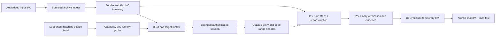
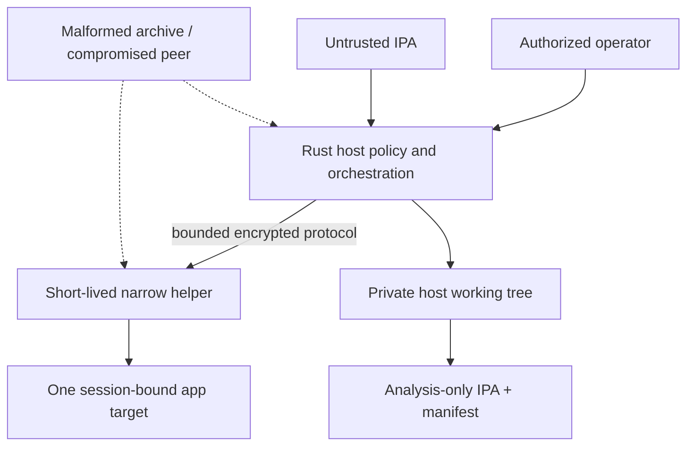

# Technical overview

[简体中文版](zh-CN/technical-overview.md)

## Purpose and status

This document explains how OrchardProbe is intended to turn one authorized IPA
into one local, analysis-only reconstructed IPA while keeping the user-facing
command simple and the security-sensitive internals auditable.

> [!IMPORTANT]
> The end-to-end device workflow is a design contract, not current behavior.
> The pre-alpha repository implements the Rust CLI foundation, bounded Mach-O
> metadata parsing, versioned schemas, synthetic DemoLab fixtures, and a bounded
> protocol specification. It has no device transport, helper, decryption
> backend, reconstructor, or IPA packager today.

Read the [user guide](user-guide.md) first for the intended command and output.
Read the [scope and threat model](architecture/RFC-0001-scope-and-threat-model.md)
before changing any device-facing boundary.

## The system contract

The planned happy path is:

```text
oprobe decrypt MyApp.ipa
```

The simple command does not make the underlying operation static or
device-free. OrchardProbe needs both:

- the **authorized source IPA**, used as the immutable local reconstruction
  input; and
- the **same validated installed build on one supported authorized device**,
  used by a narrowly reviewed backend to obtain only the required code ranges.

The output is a new, not re-signed IPA and a separate evidence manifest. The
source file is never modified in place. OrchardProbe does not acquire, install,
launch for general use, sign, or redistribute apps.

## End-to-end data flow



The pipeline is fail-closed. A required mismatch, unsupported slice, target
change, malformed frame, short read, quota failure, or incomplete verification
prevents the temporary archive from becoming the final output.

## Why an IPA alone is not enough

The input IPA contains the on-disk Mach-O representation. OrchardProbe can
parse its encryption metadata, but metadata cannot produce the corresponding
plaintext bytes. The planned backend therefore binds the local artifact to the
same installed build on an explicitly supported device environment.

This distinction creates four separate identities that must not be conflated:

| Identity | Role |
|---|---|
| Source IPA | Immutable local input and bundle layout. |
| Installed build | Device-side target whose lineage must match the input. |
| Runtime or mapped code range | Session-bound bytes returned by the selected backend. |
| Reconstructed output | New host artifact created only after validation. |

A source commit is not automatically the identity of a distributed installed
artifact. Likewise, `cryptid == 0`, a missing encryption command, or a
successful transfer is not proof that returned bytes are correct plaintext.

## Pipeline stages

### 1. Authorization and preflight

The CLI confirms the authorized-use policy and checks host architecture, free
space, dependencies, connected-device ambiguity, supported environment tuple,
and helper/backend capabilities. Compatibility is selected from observed facts
and reviewed records, never inferred from an iOS version alone.

No Apple ID, password, receipt, certificate, pairing material, or signing
identity belongs in OrchardProbe input, logs, configuration, or reports.

### 2. Bounded IPA ingest

The IPA is untrusted input. A future archive module must inspect entries before
materialization and enforce explicit limits for entry count, path bytes,
component depth, per-file size, total size, and compression ratio. It rejects:

- absolute paths, `..`, ambiguous separators, NULs, or duplicate destinations;
- symbolic links, hard links, FIFOs, sockets, devices, and other special files;
- entries outside the single selected `.app` root;
- receipts, `SC_Info`, and data-container content outside project scope; and
- archives whose declared or observed resource use exceeds the approved limits.

Extraction uses a private working directory. No archive path becomes an
authority to read or write an arbitrary host path.

### 3. Bundle and Mach-O inventory

The host identifies the main executable, frameworks, dynamic libraries, and
extensions, then parses every relevant thin or FAT Mach-O slice with checked
arithmetic and bounded seek-based reads.

The current implementation of this foundation lives in
[`crates/orchardprobe-core/src/macho.rs`](../crates/orchardprobe-core/src/macho.rs).
It validates container structure and encryption load-command metadata but never
reads or transforms encrypted payload bytes. See the
[inspect contract](development/macho-inspect.md).

Inventory order is stable and each binary has an independent outcome. A ZIP is
not considered complete merely because the main executable was processed.

### 4. Device and build matching

The host derives an expected target identity from the IPA and asks the bounded
device service to resolve the installed match. The host never supplies a PID,
raw path, address, or arbitrary memory range.

The match must be unique and must stay stable for the session. The run stops if
the selected device, helper instance, app target, mapping, bundle entry, or
capability transcript changes.

Bundle identifier and marketing version alone are not a build identity. A
reviewed matching policy must compare the strongest stable fields available for
that backend, such as bundle identifier, bundle version, executable inventory,
architectures and slices, Mach-O UUIDs, and code-signature identity. The policy
and fields used are recorded in the manifest. A missing required field or any
conflict stops the run; a weaker fallback never silently becomes an exact
match.

### 5. Capability-driven backend selection

A backend is enabled only for a physically tested, sanitized environment record
and an accepted backend ADR. The helper reports exact public capability IDs and
numeric limits. The host chooses among reviewed adapters without silently
falling back to a broader primitive.

The project currently has no approved backend. The first candidate remains
blocked on a first-party protected DemoLab oracle and an authorized-device
Go/No-Go spike.

### 6. Bounded host/helper session

The accepted protocol design is in
[RFC-0002](architecture/RFC-0002-bounded-host-helper-protocol.md). Important
properties include:

- fresh session material and explicit protocol negotiation;
- transcript binding to the selected device, helper, target, and capability set;
- authenticated encryption and replay rejection;
- hard frame, message, stream, byte, item, and deadline limits;
- opaque, single-purpose, one-shot handles instead of paths, PIDs, or addresses;
- cancellation and disconnect behavior that converges on teardown; and
- no shell, executable upload, arbitrary filesystem, or arbitrary memory API.

The specification is accepted as a design gate, but no transport or helper
implements it yet.

### 7. Mach-O reconstruction

Reconstruction happens on the Rust host, not in a privileged helper:

1. Copy the validated source Mach-O into the private work tree.
2. Select one inventory record and one exact slice.
3. Derive the declared encrypted file ranges from validated load commands.
4. Ask the backend for an opaque handle representing only the corresponding
   approved device code range.
5. Receive bounded chunks with declared offsets, sizes, sequence, and hashes.
6. Revalidate total byte counts, containment, target identity, and stream hash.
7. Write only the approved file range in the working copy.
8. Reparse the result and record its structure and evidence.

Every offset addition and range end is checked. A backend may not round outward
into unrelated pages, return caller-selected memory, or widen access after a
short read. Relocation, fixup, PAC, mapping replacement, or slice ambiguity is a
terminal item failure unless the selected backend ADR proves a narrower safe
transformation.

### 8. Verification and evidence

Outcome and evidence strength are separate. The versioned manifest records each
binary and slice independently:

| Evidence | What it establishes | What it does not establish |
|---|---|---|
| `metadata` | Header and declared encryption metadata were parsed. | Correct plaintext. |
| `structure` | The reconstructed Mach-O satisfies bounded structural checks. | That protected bytes transitioned to the right plaintext. |
| `range_hash` | Host and helper agree on bounded transferred ranges and hashes. | An independent plaintext oracle. |
| `known_plaintext` | Observed bytes match an independent first-party oracle. | General support beyond the exact recorded artifact and environment. |

For ordinary authorized apps, the strongest honest plaintext result may remain
`inconclusive` because no independent oracle exists. This does not erase an
operational reconstruction result; it prevents the CLI from overstating what
was proven.

Current Rust validation and schemas live in:

- [`crates/orchardprobe-core/src/lib.rs`](../crates/orchardprobe-core/src/lib.rs)
- [`crates/orchardprobe-core/src/wire.rs`](../crates/orchardprobe-core/src/wire.rs)
- [`schemas/`](../schemas/)
- [the schema guide](development/schemas.md)

### 9. Packaging and finalization

The packager walks the validated work tree through retained directory handles
or equivalent race-resistant references. It includes ordinary bundle files
under deterministic path and metadata rules, rejects special entries, and does
not reproduce device ownership, special bits, unrelated extended attributes,
receipts, or app data.

The output is written to a temporary file on the destination filesystem. The
host then validates archive structure, binary coverage, hashes, manifest
consistency, and size before atomically renaming it to `*.decrypted.ipa`.

OrchardProbe never re-signs the result. An embedded signature can be retained as
evidence while being invalid for installation. Signature `presence`, `kind`,
and `validation` are reported separately so the UI cannot collapse them into a
misleading “signed” boolean.

## Trust boundaries



The Rust host owns policy, parsing, resource accounting, reconstruction,
verification, packaging, redaction, and reporting. The future helper owns only
the smallest device API that cannot live on the host. Privilege never justifies
moving general parsing, paths, process selection, or packaging into the helper.

## Current code map

| Path | Current responsibility |
|---|---|
| `crates/orchardprobe-cli/src/main.rs` | Host-only CLI, safe file opening, `doctor`, `inspect`, `demo`, and manifest verification. |
| `crates/orchardprobe-core/src/macho.rs` | Bounded thin/FAT Mach-O metadata parser. |
| `crates/orchardprobe-core/src/lib.rs` | Manifest model, invariants, device-free demo, and local doctor report. |
| `crates/orchardprobe-core/src/wire.rs` | Versioned capability and structured-error wire contracts. |
| `schemas/` | Machine-checked JSON Schema contracts and positive/negative fixtures. |
| `fixtures/DemoLab/` | Project-owned Swift app, Objective-C framework, and share extension. |
| `docs/architecture/` | Security and protocol design gates. |
| `docs/compatibility/` | Evidence vocabulary and support-record workflow. |

Future transport, catalog, backend, reconstruction, archive, and report modules
must be added only after their corresponding design and evidence gates. Their
names in diagrams are responsibilities, not existing crates.

## Implementation status

| Capability | Status |
|---|---|
| Rust workspace and local CLI | Implemented |
| Secure bounded single-file Mach-O inspect | Implemented |
| FAT/FAT64 adversarial parsing coverage | Implemented |
| Versioned manifest/capability/error schemas | Implemented |
| First-party DemoLab simulator fixture | Implemented |
| Bounded protocol specification | Accepted design; not implemented |
| Protected first-party oracle | Research blocked pending real evidence |
| Device discovery and transport | Not implemented |
| Device helper and backend | Not implemented |
| Mach-O reconstruction and IPA packaging | Not implemented |
| `oprobe decrypt` | Not implemented |
| Verified compatibility matrix | Empty until real-device evidence exists |

## Learning path

For a first code-reading pass:

1. Read the [user guide](user-guide.md) to understand the product contract.
2. Run the device-free commands in the
   [workspace guide](development/getting-started.md).
3. Read `crates/orchardprobe-cli/src/main.rs` from `main` through `inspect` and
   `open_regular_file` to see CLI error and host file-safety conventions.
4. Read `crates/orchardprobe-core/src/macho.rs`: start at `parse_macho`, follow
   `parse_fat`, then `parse_slice`, range helpers, and adversarial tests.
5. Read `crates/orchardprobe-core/src/lib.rs` beside
   `schemas/v0/export-manifest-v2.schema.json` to compare Rust invariants with
   the wire contract.
6. Read `wire.rs`, the schema guide, and the golden/invalid fixtures.
7. Build DemoLab through `fixtures/DemoLab/README.md` and inspect only its
   project-generated binaries.
8. Read RFC-0001 before RFC-0002; then read the compatibility policy and test
   record to understand why implementation remains blocked on evidence.

When adding a module, preserve the invariant that untrusted values are evidence
to validate, not authority to select a path, target, process, address, range, or
privilege.

## Definition of the first usable alpha

The one-command workflow is not ready merely when a prototype can emit a ZIP.
The alpha gate requires, for one exact supported device tuple:

- `oprobe decrypt Input.ipa` automatically finds the unique matching build;
- all required binaries and slices in the declared MVP scope have explicit
  outcomes, with no silent skip;
- the original input is unchanged and final output publication is atomic;
- transport, helper, backend, reconstruction, verification, and packaging obey
  reviewed numeric limits and teardown rules;
- output signature limitations and per-binary evidence are visible;
- two clean DemoLab runs are reproducible under a reviewed test record; and
- the docs and compatibility matrix name only the exact physically tested
  environment, without generalizing to nearby devices or releases.

Until those conditions are met, examples of `oprobe decrypt` must remain marked
as planned rather than presented as working installation instructions.
