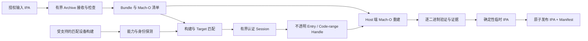
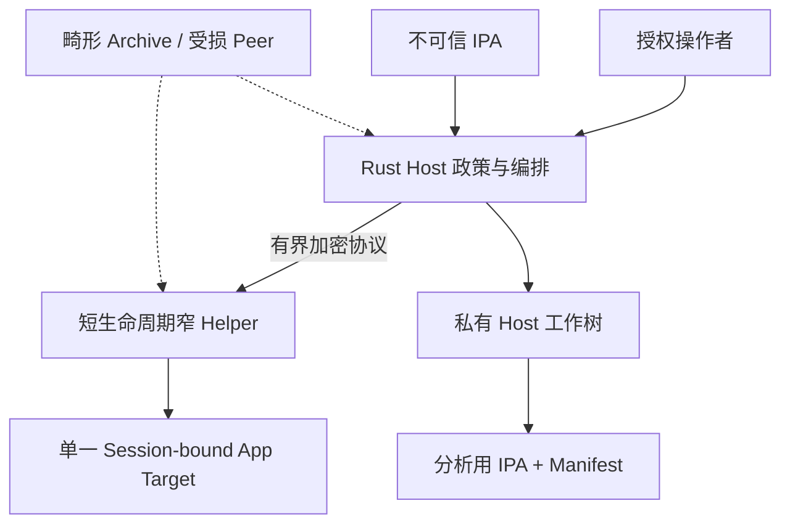

# 技术总览

[English version](../technical-overview.md)

## 文档目的与当前状态

本文解释 OrchardProbe 计划如何把一个授权 IPA 转换成一个本地、仅供分析的重建
IPA，同时保持用户命令简单、内部安全敏感流程可审计。

> [!IMPORTANT]
> 端到端设备流程目前只是技术契约，不是现有功能。当前 pre-alpha 仓库实现了
> Rust CLI 基础、有界 Mach-O 解析、IPA Archive 元数据预检和有界内存/流式
> Entry 读取、根 App XML/Binary plist Event 的有界身份解析及其声明主程序的
> Mach-O 结构检查、明确不完整的约定路径 Framework/dylib/Extension 候选清单、
> 版本化 Schema、合成 DemoLab Fixture 和有界协议规范，但还没有设备 Transport、
> Helper、解密后端、重建器或 IPA Packager。

先阅读[用户指南](user-guide.md)了解目标命令与输出。修改任何设备边界前，必须
阅读[范围与威胁模型（英文）](../architecture/RFC-0001-scope-and-threat-model.md)。

## 系统契约

计划中的成功路径是：

```text
oprobe decrypt MyApp.ipa
```

命令简单不代表操作是纯静态或不需要设备。OrchardProbe 同时需要：

- **授权的源 IPA**：只读的本地重建输入；
- **一台受支持授权设备上的同一已验证构建**：边界严格的后端只从中取得必需
  代码区间。

输出是新的未重签 IPA 和独立证据 Manifest。源文件不原地修改。OrchardProbe
不负责获取、安装、通用启动、签名或分发 App。

## 端到端数据流



流水线 Fail Closed。任何必需项不匹配、不支持的 Slice、Target 变化、畸形 Frame、
短读、配额失败或验证不完整，都会阻止临时 Archive 变成最终输出。

## 为什么只有 IPA 不够

输入 IPA 包含磁盘上的 Mach-O 表示。OrchardProbe 可以解析它的加密元数据，但
元数据不能产生对应明文字节。计划中的后端必须把本地产物绑定到明确支持设备上
相同的已安装构建。

以下四种身份不能混为一谈：

| 身份 | 作用 |
|---|---|
| 源 IPA | 不可变的本地输入和 Bundle 布局。 |
| 已安装构建 | 必须与输入匹配的设备端 Target。 |
| Runtime / Mapped Code Range | 所选后端针对本次 Session 返回的字节。 |
| 重建输出 | 通过校验后在 Host 新建的产物。 |

源码 Commit 不自动等于分发后已安装产物的身份。`cryptid == 0`、缺少加密命令
或传输成功也不证明返回字节是正确明文。

## 流水线各阶段

### 1. 授权与预检

CLI 确认授权用途政策，并检查 Host 架构、磁盘、依赖、设备选择歧义、受支持
环境 Tuple、Helper 与后端能力。兼容性来自实际观察和评审记录，不能只根据 iOS
版本猜测。

Apple ID、密码、Receipt、证书、Pairing Material 和签名身份不应出现在
OrchardProbe 输入、日志、配置或报告中。

### 2. 有界 IPA 输入

IPA 是不可信输入。Archive 接收必须先检查 Entry，再物化文件，并为 Entry
数量、路径字节、组件深度、单文件大小、总大小和压缩比设置明确上限。必须拒绝：

- 绝对路径、`..`、歧义分隔符、NUL 和重复目标；
- Symlink、Hard Link、FIFO、Socket、Device 等特殊文件；
- 超出唯一所选 `.app` 根目录的 Entry；
- Receipt、`SC_Info` 和范围外的数据容器；
- 声明或实际资源使用超过上限的 Archive。

解包只发生在私有工作目录。Archive 路径永远不能成为读写任意 Host 路径的权限。

当前库实现了本阶段的只读元数据预检和单个 Entry 的有界内存/调用方 Sink 读取，代码位于
[`crates/orchardprobe-core/src/ipa.rs`](../../crates/orchardprobe-core/src/ipa.rs)。
它验证有界 ZIP/ZIP64 Directory 与 Local Header 元数据并返回确定性 Entry 清单；
完整预检通过后，还能按精确路径把一个 Stored/Deflate 普通文件读入有上限的内存
Buffer 或流式写入调用方 Sink，并检查压缩输入、实际输出、CRC 和声明长度。
Archive 层不会选择 Host 输出路径，也未接入 CLI。精确契约见
[IPA 预检与 Entry 读取开发文档（英文）](../development/ipa-preflight.md)。

独立的
[`crates/orchardprobe-core/src/ipa_app.rs`](../../crates/orchardprobe-core/src/ipa_app.rs)
会定位大小写精确的根 `Info.plist`，只解析有界 XML 或 Binary plist Event，校验
Bundle ID 与版本字段，并把 `CFBundleExecutable` 解析为精确的普通文件 Entry。
它只返回元数据；完整 Bundle Code 清单与 Archive 物化仍未实现。精确契约见
[有界 Info.plist 元数据文档（英文）](../development/ipa-info-plist.md)。

### 3. Bundle 与 Mach-O 清单

Host 识别主可执行文件、Framework、动态库和 Extension，然后使用 Checked
Arithmetic 和有界 Seek Read 解析所有相关 Thin/FAT Mach-O Slice。

当前基础实现位于
[`crates/orchardprobe-core/src/macho.rs`](../../crates/orchardprobe-core/src/macho.rs)。
它验证容器结构与加密 Load Command 元数据，但不读取或转换加密 Payload。精确
行为见 [inspect 契约（英文）](../development/macho-inspect.md)。

[`crates/orchardprobe-core/src/ipa_code.rs`](../../crates/orchardprobe-core/src/ipa_code.rs)
现会绑定根 App 元数据与第二次完整 IPA 清单，把声明的精确主程序流式写入自动
清理的匿名临时文件，再调用该 Parser。它只产生根主程序结构元数据；精确契约见
[IPA 主程序检查文档（英文）](../development/ipa-main-executable.md)。

[`crates/orchardprobe-core/src/ipa_catalog.rs`](../../crates/orchardprobe-core/src/ipa_catalog.rs)
会确定性发现约定命名的 Framework、dylib、Extension 和 Extension 内 Framework
候选；只有同一 Parser 通过后才称为 Code，误报和畸形候选保持可见。在嵌套
Bundle plist 解析出非标准可执行名之前，其 Coverage 明确是不完整的。精确契约见
[Code 候选清单文档（英文）](../development/ipa-code-inventory.md)。

清单顺序稳定，每个二进制独立产生结果。只处理主程序后生成 ZIP 不算完整成功。

### 4. 设备与构建匹配

Host 从 IPA 派生期望 Target 身份，并让有界设备服务解析唯一的已安装匹配项。
Host 不向设备提供 PID、原始路径、地址或任意内存区间。

匹配必须唯一并在 Session 内保持稳定。所选设备、Helper Instance、App Target、
Mapping、Bundle Entry 或 Capability Transcript 发生变化时立即停止。

Bundle Identifier 和 Marketing Version 本身不能代表唯一构建身份。经过评审的
匹配策略必须比较该后端可获得的最强稳定字段，例如 Bundle Identifier、Bundle
Version、可执行文件清单、架构与 Slice、Mach-O UUID 和代码签名身份。Manifest
记录本次策略与使用字段；缺少必需字段或任何字段冲突都会停止，较弱回退不能静默
变成“精确匹配”。

### 5. 基于能力选择后端

只有具备真机测试、脱敏环境记录和已接受后端 ADR 的后端才能启用。Helper 返回
精确的公开 Capability ID 和数值上限。Host 只能在已评审 Adapter 中选择，不得
静默回退到权限更宽的原语。

项目目前没有已批准后端。第一个候选仍被首方受保护 DemoLab Oracle 和授权设备
Go/No-Go Spike 阻塞。

### 6. 有界 Host/Helper Session

已接受的协议设计位于
[RFC-0002（英文）](../architecture/RFC-0002-bounded-host-helper-protocol.md)，
关键属性包括：

- 新鲜 Session Material 和显式协议协商；
- Transcript 与设备、Helper、Target、Capability Set 绑定；
- 认证加密与 Replay 拒绝；
- Frame、Message、Stream、Byte、Item 和 Deadline 硬上限；
- 使用单一用途、一次性不透明 Handle，不使用路径、PID 或地址；
- Cancel/Disconnect 最终收敛到 Teardown；
- 不提供 Shell、可执行文件上传、任意文件系统或任意内存 API。

该规范只是已接受的设计门槛，当前没有 Transport 或 Helper 实现它。

### 7. Mach-O 重建

重建发生在 Rust Host，不在高权限 Helper：

1. 把已验证源 Mach-O 复制到私有工作树。
2. 选择一个清单记录和一个精确 Slice。
3. 从已验证 Load Command 得到声明的加密文件区间。
4. 请求只代表对应批准设备代码区间的不透明 Handle。
5. 接收带 Offset、Size、Sequence 和 Hash 的有界 Chunk。
6. 重新验证总字节数、Containment、Target 身份和 Stream Hash。
7. 只写工作副本中的批准文件区间。
8. 重新解析结果，记录结构和证据。

所有 Offset 加法和 Range End 都必须 Checked。后端不能向外取整到无关 Page、
返回调用方选择的内存，或在短读后扩大权限。Relocation、Fixup、PAC、Mapping
替换或 Slice 歧义必须使该项失败，除非后端 ADR 已证明更窄且安全的转换。

### 8. 验证与证据

Outcome 与证据强度相互独立。版本化 Manifest 逐二进制、逐 Slice 记录：

| 证据 | 能证明什么 | 不能证明什么 |
|---|---|---|
| `metadata` | 已解析 Header 和声明加密元数据。 | 正确明文。 |
| `structure` | 重建 Mach-O 通过有界结构验证。 | 受保护字节已转换成正确明文。 |
| `range_hash` | Host/Helper 对有界区间字节数和 Hash 一致。 | 独立明文 Oracle。 |
| `known_plaintext` | 观察字节匹配独立首方 Oracle。 | 超出精确产物与环境的普遍支持。 |

普通授权 App 通常没有独立 Oracle，因此最诚实的明文结果可能仍是
`inconclusive`。这不抹掉操作层面的重建结果，而是防止 CLI 夸大已证明内容。

当前 Rust 验证和 Schema 位于：

- [`crates/orchardprobe-core/src/lib.rs`](../../crates/orchardprobe-core/src/lib.rs)
- [`crates/orchardprobe-core/src/wire.rs`](../../crates/orchardprobe-core/src/wire.rs)
- [`schemas/`](../../schemas/)
- [Schema 指南（英文）](../development/schemas.md)

### 9. 打包与最终发布

Packager 通过保留的 Directory Handle 或同等抗竞态引用遍历工作树，按确定性
Path/Metadata 规则加入普通 Bundle 文件，拒绝特殊 Entry，不复制设备 Ownership、
特殊权限位、无关 Extended Attribute、Receipt 或 App Data。

输出先写入目标文件系统上的临时文件，再验证 Archive 结构、二进制覆盖、Hash、
Manifest 一致性和大小，最后原子重命名为 `*.decrypted.ipa`。

OrchardProbe 永远不重签。嵌入签名可以作为证据保留，但不再适合安装。
`presence`、`kind` 和 `validation` 分开报告，避免 UI 折叠成误导性的“已签名”。

## 信任边界



Rust Host 负责政策、解析、资源记账、重建、验证、打包、脱敏和报告。未来 Helper
只负责无法合理留在 Host 的最小设备 API。高权限不能成为把通用解析、路径、进程
选择或打包移入 Helper 的理由。

## 当前源码地图

| 路径 | 当前职责 |
|---|---|
| `crates/orchardprobe-cli/src/main.rs` | Host-only CLI、安全文件打开、`doctor`、`inspect`、`demo` 和 Manifest 验证。 |
| `crates/orchardprobe-core/src/ipa.rs` | 只读 ZIP/ZIP64 预检、确定性 IPA 清单和有界 CRC 校验内存/调用方 Sink Entry 读取。 |
| `crates/orchardprobe-core/src/ipa_app.rs` | 有界 XML/Binary 根 `Info.plist` Event 解析、App 身份校验和精确主程序 Entry 定位。 |
| `crates/orchardprobe-core/src/ipa_code.rs` | 绑定完整清单的根主程序流式读取，以及通过匿名临时文件执行的有界 Mach-O 元数据检查。 |
| `crates/orchardprobe-core/src/ipa_catalog.rs` | 确定性、有界的约定 Code 候选发现、Mach-O 确认和可见拒绝原因。 |
| `crates/orchardprobe-core/src/macho.rs` | 有界 Thin/FAT Mach-O 元数据解析器。 |
| `crates/orchardprobe-core/src/lib.rs` | Manifest 模型、不变量、Device-free Demo 和本地 Doctor Report。 |
| `crates/orchardprobe-core/src/wire.rs` | 版本化 Capability 与结构化错误 Wire Contract。 |
| `schemas/` | CI 验证的 JSON Schema 与正/负 Fixture。 |
| `fixtures/DemoLab/` | 项目自有 Swift App、Objective-C Framework 和 Share Extension。 |
| `docs/architecture/` | 安全与协议设计门槛。 |
| `docs/compatibility/` | 证据词汇和支持记录流程。 |

未来 Transport、Backend、Reconstruction、Archive 物化与 Report 模块
只有在各自设计和证据门槛满足后才能加入。图中的名字表示职责，不表示已有 Crate。

## 实现状态

| 能力 | 状态 |
|---|---|
| Rust workspace 与本地 CLI | 已实现 |
| 安全有界单文件 Mach-O Inspect | 已实现 |
| 有界只读 IPA Archive 预检 | 库内已实现；尚未接入 CLI |
| 有界 Stored/Deflate IPA Entry 读取 | 库内存/调用方 Sink 读取已实现；尚未接入 CLI |
| 有界根 Info.plist 身份解析 | XML/Binary Event 库内实现；尚无完整 Code 清单或 CLI 接入 |
| IPA 根主程序 Mach-O 元数据 | 库内已实现；尚未接入 CLI |
| 约定路径 Framework/dylib/Extension Code 候选 | 明确不完整的库内清单已实现；仍需嵌套 plist 解析和 CLI 接入 |
| FAT/FAT64 对抗解析覆盖 | 已实现 |
| 版本化 Manifest/Capability/Error Schema | 已实现 |
| 首方 DemoLab Simulator Fixture | 已实现 |
| 有界协议规范 | 设计已接受；未实现 |
| 受保护首方 Oracle | 等待真实证据，研究被阻塞 |
| 设备发现与 Transport | 未实现 |
| 设备 Helper 与 Backend | 未实现 |
| Mach-O 重建与 IPA 打包 | 未实现 |
| `oprobe decrypt` | 未实现 |
| Verified 兼容矩阵 | 等待真机证据，目前为空 |

## 推荐学习顺序

第一次阅读源码可以按以下顺序：

1. 读[用户指南](user-guide.md)，理解产品契约。
2. 按 [Workspace 指南（英文）](../development/getting-started.md)运行无需设备命令。
3. 先读 [IPA 预检与 Entry 读取契约（英文）](../development/ipa-preflight.md)，再跟踪
   `crates/orchardprobe-core/src/ipa.rs` 中的 `read_footer`、
   `read_central_directory`、`validate_local_header`、
   `read_ipa_entry_bounded` 和对抗测试。
4. 读[有界 Info.plist 元数据契约（英文）](../development/ipa-info-plist.md)，再跟踪
   `crates/orchardprobe-core/src/ipa_app.rs` 中的 `inspect_ipa_app_metadata`、
   `parse_info_events`、`skip_value` 和 XML/Binary 上限测试。
5. 读 [IPA 主程序检查契约（英文）](../development/ipa-main-executable.md)，再跟踪
   `copy_ipa_entry_bounded`、`inspect_ipa_main_executable` 及 CRC、Sink 失败、
   清单漂移和 Mach-O 测试。
6. 读 [Code 候选清单契约（英文）](../development/ipa-code-inventory.md)，再跟踪
   `discover_candidates`、`validate_candidate_set`、`inspect_ipa_code_inventory`
   及角色/拒绝测试。
7. 从 `main`、`inspect`、`open_regular_file` 阅读
   `crates/orchardprobe-cli/src/main.rs`，了解 CLI 错误和 Host 文件安全惯例。
8. 阅读 `crates/orchardprobe-core/src/macho.rs`：先看 `parse_macho`，再跟踪
   `parse_fat`、`parse_slice`、Range Helper 和对抗测试。
9. 把 `crates/orchardprobe-core/src/lib.rs` 与
   `schemas/v0/export-manifest-v2.schema.json` 对照，理解 Rust 不变量和 Wire Contract。
10. 阅读 `wire.rs`、Schema 指南、Golden 与 Invalid Fixture。
11. 按 `fixtures/DemoLab/README.md` 构建 DemoLab，只检查项目生成的二进制。
12. 先读 RFC-0001，再读 RFC-0002，最后读兼容性政策和测试记录，理解为什么设备
   实现仍被证据门槛阻塞。

新增模块时必须保持一条核心不变量：不可信值只是等待验证的证据，不能成为选择
路径、Target、Process、Address、Range 或 Privilege 的权限。

## 首个可用 Alpha 的定义

原型能生成 ZIP 不代表一条命令已经可用。对一个精确支持设备 Tuple，Alpha 门槛
至少包括：

- `oprobe decrypt Input.ipa` 自动找到唯一匹配构建；
- MVP 范围内所有必需 Binary/Slice 都有明确结果，没有静默跳过；
- 原始输入保持不变，最终输出原子发布；
- Transport、Helper、Backend、重建、验证和打包遵守评审过的数值上限与清理规则；
- 输出签名限制和逐二进制证据清楚可见；
- DemoLab 在评审过的 Test Record 下完成两次干净可复现运行；
- 文档和兼容矩阵只写精确真机环境，不泛化到相邻设备或版本。

这些条件满足前，`oprobe decrypt` 示例必须明确标记为计划功能，不能作为现有安装
说明。
